# Laufbursche Edition

An alternative app for Teverun e-scooters.

<!-- Project repository: https://github.com/Laufbursche42/tr-lb-edition -->
**[Download the latest release](https://github.com/Laufbursche42/tr-lb-edition/releases/latest)**

## Table of contents

- [For users](#for-users)
  - [What the app is](#what-the-app-is)
  - [Features](#features)
  - [Screenshots](#screenshots)
  - [Installing the app](#installing-the-app)
  - [Privacy & data protection](#privacy--data-protection)
  - [Permissions](#permissions)
  - [Disclaimer & Trademarks](#disclaimer--trademarks)
- [For developers](#for-developers)
  - [Architecture](#architecture)
  - [Getting the code](#getting-the-code)
  - [Prerequisites](#prerequisites)
  - [Building from source](#building-from-source)
    - [Debug build](#debug-build)
    - [Release build](#release-build)
    - [Debug vs release](#debug-vs-release)
  - [BLE protocol reference](#ble-protocol-reference)
    - [1. BLE connection](#1-ble-connection)
    - [2. Incoming telemetry frames](#2-incoming-telemetry-frames-vcu---phone)
    - [3. Outgoing commands](#3-outgoing-commands-phone---vcu)
    - [4. Motor enable / disable](#4-motor-enable--disable-single-vs-dual-drive-mode)
    - [5. Implementation notes](#5-implementation-notes-for-the-java-layer)
  - [Firmware (reverse engineering)](#firmware-reverse-engineering)
    - [The double-gated 22 km/h speed clamp](#the-double-gated-22-kmh-speed-clamp)
    - [Gate 1 - VCU identity](#gate-1---vcu-identity)
    - [Gate 2 - the display clamp bit](#gate-2---the-display-clamp-bit)
    - [Removing the clamp in VCU firmware](#removing-the-clamp-in-vcu-firmware)
    - [VCU bootloader OTA and firmware read-back](#vcu-bootloader-ota-and-firmware-read-back)
    - [Display firmware flashing](#display-firmware-flashing)
    - [Region write-protection - locked vs free settings](#region-write-protection---locked-vs-free-settings)
    - [Sleep and power-off timer quirk](#sleep-and-power-off-timer-quirk)
    - [Inter-MCU transport map](#inter-mcu-transport-map)
    - [Original Teverun app behaviour](#original-teverun-app-behaviour)
    - [Chip and hardware access](#chip-and-hardware-access)
    - [Legal and safety](#legal-and-safety)
- [License](#license)
- [Porting to Apple platforms (iOS / iPadOS)](#porting-to-apple-platforms-ios--ipados)

# For users

## What the app is

Laufbursche Edition is a standalone, alternative Android app for Teverun / Laufbursche e-scooters. It works completely offline and talks to your scooter directly over Bluetooth LE. There is no Teverun account, no login and no cloud - just install the app, connect to your scooter and you are ready to go.

## Features

Everything below is implemented and shipping in the app.

### Dashboard

- **Live speed drums** - side-by-side scooter speed and GPS speed.
- **Hero tiles** - state of charge (SOC), current gear and battery current at a glance.
- **Dual-motor tiles** - per-motor temperatures, currents and power for the front and rear motors.
- **Motor-mode quick-toggle** next to the **Motors** heading on the main screen - **Front / Rear / Both / Smart-TCS**. It reflects the scooter's current mode and is disabled while disconnected.

### "All values" telemetry (scroll down on the main screen)

- Shows **every value the scooter reports**: battery relays, charge/discharge switches, per-cell voltages and temperatures, pack / MOS / BMS-board temperatures, capacity, per-motor currents and temperatures, controller status flags, recuperation and more.
- **Each row has a "?" help popup** explaining what the value means.
- **Stale values clear when disconnected** so you never read an old number as live.

### Connection

- **Bluetooth LE connect** with a Bluetooth-glyph indicator: **green = connected, red = disconnected**.
- **Remembers the last scooter and auto-reconnects.**
- **"Last device" quick-reconnect** button.

### Scooter & controller settings

- **Full settings with an explicit Save button** - nothing is written to the scooter until you press **Save**.
- **A "?" help popup on EVERY setting.**
- **Per-gear settings editor** - per-gear speed limit, EABS / recuperation, start levels and currents. On eKFV units the internal gears 2/3/4 are shown as 1/2/3 on the scooter's own display. The controller sends only the CURRENTLY active gear to the app, so if a gear's values are missing you have to switch through all gears once on the scooter to load them. The app reads these values live and never stores them on the phone, because a stale gear value must never be shown or written back to the controller.
- **Live 1 s refresh** while the settings screen is open, without clobbering edits you are making in the app or changes made on the scooter's own display.
- **Motor mode** (Dual / Rear / Front) and **Smart mode** (TCS traction control).
- **Manufacturer-locked settings cannot be changed** - the app can only change settings the controller actually allows. Any setting the manufacturer has locked in the controller cannot be changed from this app or from any other app. This limit does not apply when the controller runs custom or open firmware.
- **Country write-protection** - the app displays all of the settings the scooter's controller supports, but the controller enforces a write-protection that depends on your country or region. Depending on the country the controller will not save (it write-protects) some settings, so some of the functions shown in the app may not be available or changeable in every country - the app still shows them, but the controller may refuse to store them. This country write-protection is enforced by the controller firmware and does not apply when the controller runs custom or open firmware.

### Firmware update

- **What it is** - flash controller firmware (a `.hex` file) to the scooter over Bluetooth, straight from the app. It is reached via **Settings -> Firmware update**. It works from a local file only and needs no cloud account: the original app reaches firmware through a vendor server / OTA path that requires a Teverun account, while this flashes a file you already have on the phone.
- **Same protocol, run natively** - it is a byte-for-byte reimplementation of the original app's local-file flasher (the legacy VCU / BMS path), so the exact same update sequence runs on the phone.
- **Compatibility is checked by content, not by file name (the key difference)** - the original app decides whether a file may be flashed from its **file name** (its `isComplyRules` rule): the name has to start with `AWIVCU` or `AWVCU`; on an eKFV / TDE unit the version segment must also end in "5" (the R5 series). That name rule is brittle and is the cause of the well-known "Error loading upgrade file" message - a correctly working firmware whose file was shortened or renamed (for example an `ALI`-named file) is rejected purely because of its name. Laufbursche Edition checks the file itself instead and shows the original file-name rule only as an advisory line, not as a blocker. It verifies:
  - **File integrity** - a CRC16 over the image.
  - **Controller app region** - the image must target the controller application region, not the bootloader.
  - **Controller target** - the image must be a controller image, not a battery (BMS) image.
  - **Firmware generation** - the file's own trailer version is compared against the version currently installed on the scooter.
- **Two consequences of the content check** - first, a file the original app would reject purely over its **name** can still be flashed here when it is actually compatible. Second, renaming a file does not fool this app: it reads the version from the file's trailer, not from the name - in the original app renaming a file so the name passes the rule is exactly how people work around the gate, but here a rename changes nothing about the compatibility verdict.
- **Clear pass / fail checklist with an informed override** - when the content check does not pass, **Start** is disabled and a checklist shows exactly which check failed. An explicit "flash anyway" override is available for informed users on every check except a failed integrity (CRC) check, which can never be overridden.
- **Safety and behaviour** - before anything is written the app shows a confirmation warning that the flash takes about 13 minutes. The screen stays on for the whole flash and a progress bar, a live log plus a **Cancel** button run throughout. An interrupted flash is not a brick: the controller stays in update mode, so you can simply flash it again. As a strong precaution, do a dry run with the stock firmware first.
- **Road approval** - flashing non-stock controller firmware can change how the scooter behaves; anything that alters the approved configuration has the road-approval and insurance consequences described in the [Legal and safety](#legal-and-safety) note.

### Firmware Patcher

- **What it is** - build an unlocked or bug-fixed controller firmware right on the phone, then flash it, via **Settings -> Firmware Patcher**. When it finishes it hands the file straight to the Firmware update page. Two firmwares are bundled: **R5.4.19** (the stock eKFV firmware) and the already-open **ALI D3.4.12**. Big thanks to [Spoonkey's Webpatcher](https://spooonky.github.io/Teverun-Fighter-Mini-Pro-Eco-eKFV-Firmware/), whose firmware research this builds on.
- **WARNING - Box C only, at your own risk** - use this ONLY on a Box C / IVCU-V5.X controller. Box C is the box used by the Fighter Mini (including the eKFV version), Blade GT II, Fighter 11 and Supreme+. Do NOT flash it on Box A (HW V3.X), Box B (V4.X) or the special C1 / C2 boards. Flashing controller firmware changes how the scooter behaves and carries the road-approval and insurance consequences in the [Legal and safety](#legal-and-safety) note. A bad or interrupted flash is recoverable - the controller stays in update mode and can simply be flashed again, it is not bricked - but the responsibility is yours. The stock R5.4.19 is your recovery firmware.
- **How to use it** - pick your firmware (R5.4.19 for an eKFV box, ALI for an already-open one); for R5.4.19 tick the options you want, or leave everything off to get the unmodified original; then press the button - it reads **"Build patch & continue"** when you chose something and **"Original Firmware & Continue"** when nothing is selected - and it opens the update page with the ready-to-flash file.
- **R5.4.19 options** - **Speed**: *Full unlock* (removes the 22 km/h clamp - full speed), *Live toggle (FIN)* (removes only the display clamp, so the in-app FIN switch stays your live speed lock/unlock) or *Keep ~22 km/h* (the stock cap, the default). The other options track the speed mode: **ZeroStart** (move off from a standstill without kicking) and **Cruise control** ride on an unlock, so they are offered with *Full unlock* and *Live toggle* only - on modern units both come with the unlock automatically, while the very first "Charge-1" batch needs *Full unlock* with **ZeroStart** ticked. **WheelDiameter persists** (the display wheel-diameter setting survives a restart) works with *Full unlock* and *Keep ~22 km/h* but not *Live toggle*. **Blinker fix** (restores the turn-signal blink broken in 5.4.19) works in any mode.
- **How it works** - it parses the bundled Intel-HEX, applies the exact byte edits for the chosen options, recomputes the firmware CRC and writes a new flashable `.hex` - all on the phone, offline, nothing is uploaded. ALI is only converted to a flashable file (it is already open). The two firmwares are cross-compatible on Box C hardware, so you can switch either way at any time: pick R5.4.19 to make an open box eKFV-compliant, or flash ALI to make an eKFV box fully open.

### Info & diagnostics

- **Error reports** view - read out the fault codes the scooter reports.
- **Info page** showing, read-only and read live from the scooter over Bluetooth: **FIN / Bluetooth name** (the scooter's Bluetooth name is its full FIN), the **frame number** and the IVCU **software** and **hardware** versions. (The app version lives in the "Version Info & Disclaimer" entry, not here.)

### Screen streaming

- **SRT screen streaming** to your own server - constant ~30 fps, with the server URL encrypted and stored on the device.

### Offline bicycle navigation

- **Live offline routing** that avoids motorways.
- **Enter start and destination** - type each as coordinates or long-press the map to drop the destination. Each field has a **"Here"** button that inserts your current GPS position and leaving the start empty simply means "start from my current position".
- **The map stays where you put it** - dragging the map no longer snaps back to your GPS position, so you can freely look around. Tap the crosshair button to recenter on yourself and resume auto-follow.
- **Route-preference profiles** - pick how the route is calculated:
  - **Balanced** - a mix of roads and paths that avoids motorways - a good all-round route.
  - **Shortest** - the shortest distance (may use bigger roads if they are shorter).
  - **Bike paths** - prefers cycleways and field tracks and avoids main roads as much as possible.
- **"Start navigation" follow-along mode** - after a route is calculated you tap **Start**; the map follows you and zooms in. A big next-turn card shows the upcoming turn and the distance to it plus the remaining distance and a rough ETA. A **Stop** button ends it.
- **Turn-by-turn voice guidance** using your phone's built-in text-to-speech. The app speaks the directions in English using the voice your phone already has (its default text-to-speech engine), so no extra voice download is needed. If your phone has no matching voice it simply stays silent and shows the directions on screen. Voice can be turned off. (The rest of the app stays in English as well.)
- **Camping and Charging POI overlays** - charging is filterable by **Schuko / Type 2**.
- **Dark-map mode.**
- **"Show on map"** - display a recorded ride on the offline map.
- **Automatic routing-data download** - the cycling-directions data (BRouter segments) downloads automatically for the area you route in. You can also download it manually and delete it on the maps page (the same screen where you download offline country maps).

### Offline maps

- **In-app EU offline map download** - per-country maps, no PC and no cables needed.
- Runs as a **background service**, so a download keeps going with the screen locked.
- **Per-map Delete** to free space.

### Recording, logging & preferences

- **GPS track recording** with a configurable interval (**1 / 2 / 5 / 10 / 30 s**) and **per-route GPX export**.
- **Ride log** (**off by default**) - when enabled, it records **all main-screen values once per minute** while you ride. Recording only starts once you are actually moving (after the scooter's speed first goes above 0), so parking or connecting without riding produces no ride. It runs as a foreground service so it keeps recording with the screen off, keeps the **last 3 rides** and lets you export each ride as **CSV or JSON** from the Scooter Info page (via the Android share sheet). The exported CSV/JSON can be visualised as graphs with the companion **[Laufbursche Edition Analysis Tool (leat)](https://github.com/Laufbursche42/leat)**.
- **In-app debug logging** - persistent, with a red banner while active and an **export** button. No PC needed.
- **Full-screen toggle** (when off, the app sits below the Android status bar), **km / mph** units, **light / dark app theme** and a **"Version Info & Disclaimer"** entry.

## Screenshots

All screenshots are from the app running on a real scooter; any scooter-identifying details (the FIN / Bluetooth name and the frame number) are redacted. The image files live in the [`screenshots/`](screenshots/) folder.

<table>
  <tr>
    <td align="center" width="33%">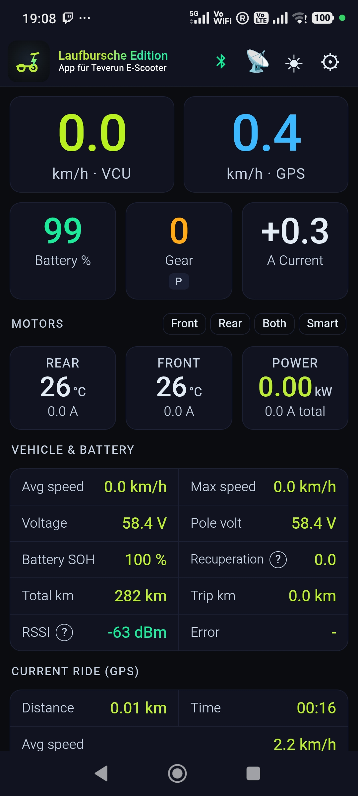</td>
    <td align="center" width="33%">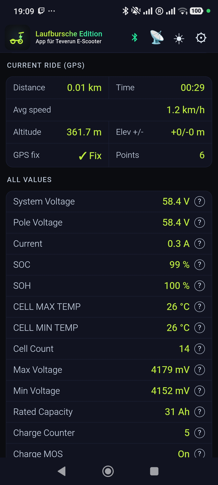</td>
    <td align="center" width="33%">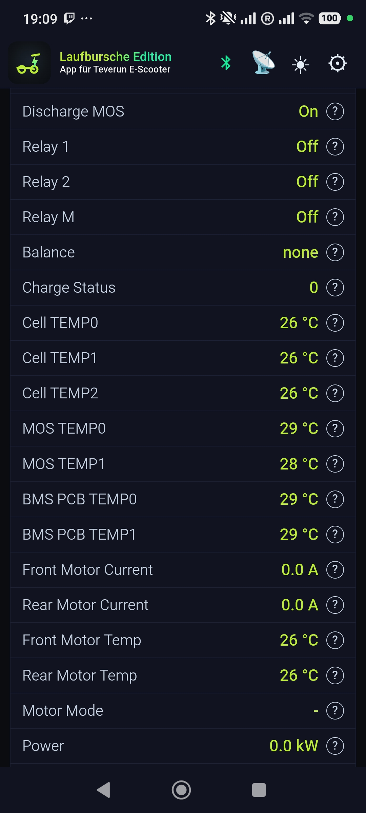</td>
  </tr>
  <tr>
    <td align="center">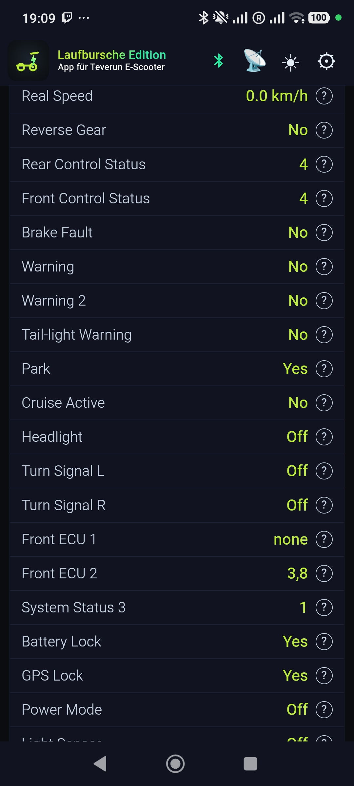</td>
    <td align="center">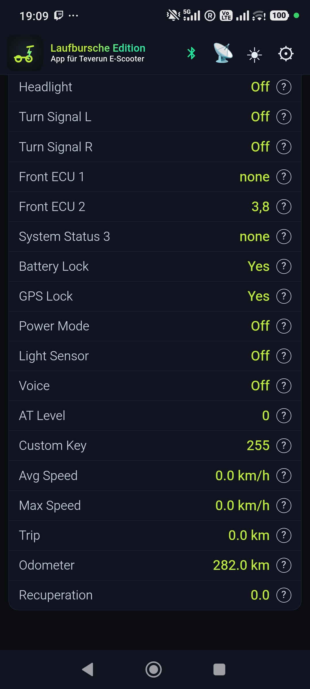</td>
    <td align="center">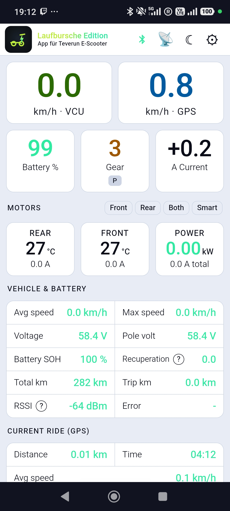</td>
  </tr>
  <tr>
    <td align="center">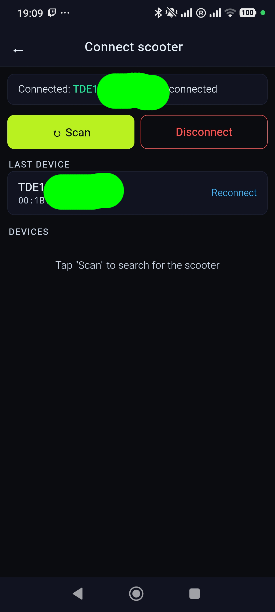</td>
    <td align="center">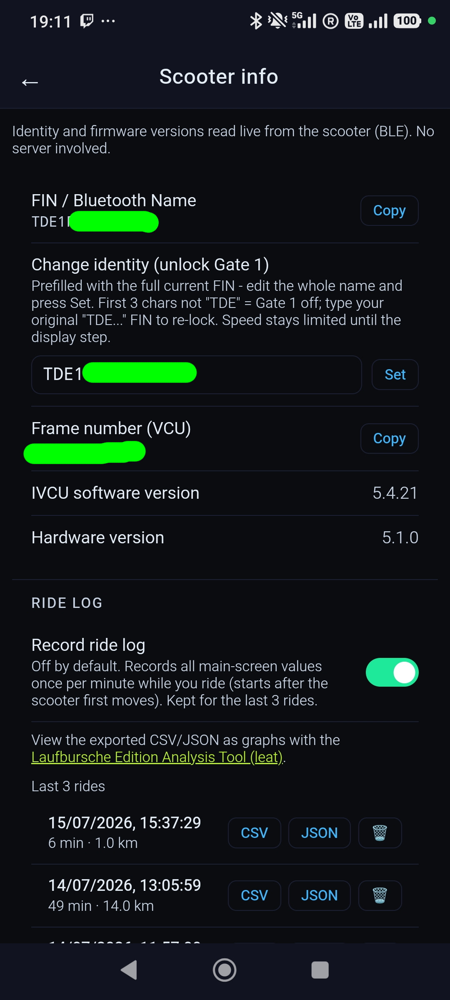</td>
    <td align="center">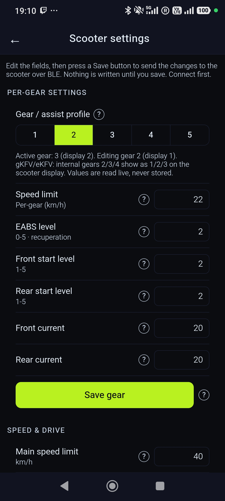</td>
  </tr>
  <tr>
    <td align="center">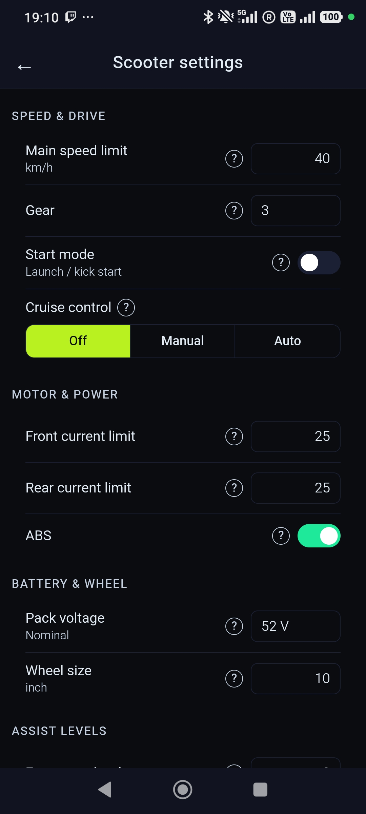</td>
    <td align="center">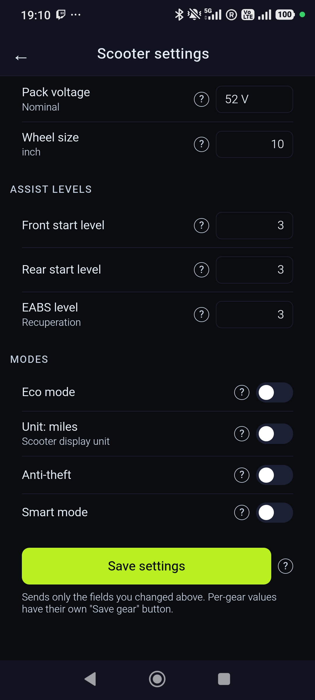</td>
    <td align="center">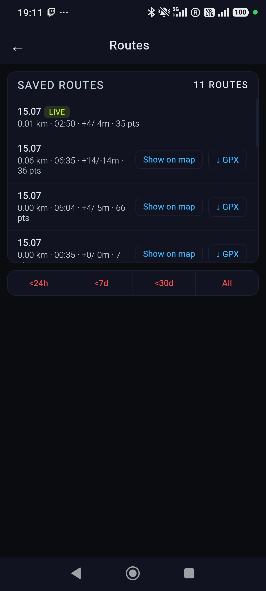</td>
  </tr>
  <tr>
    <td align="center">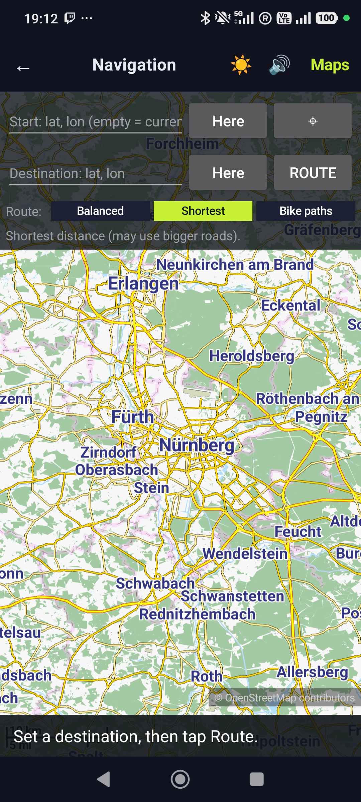</td>
    <td align="center">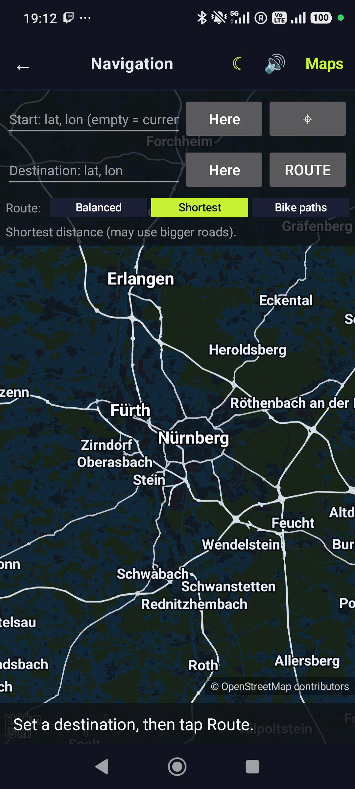</td>
    <td align="center">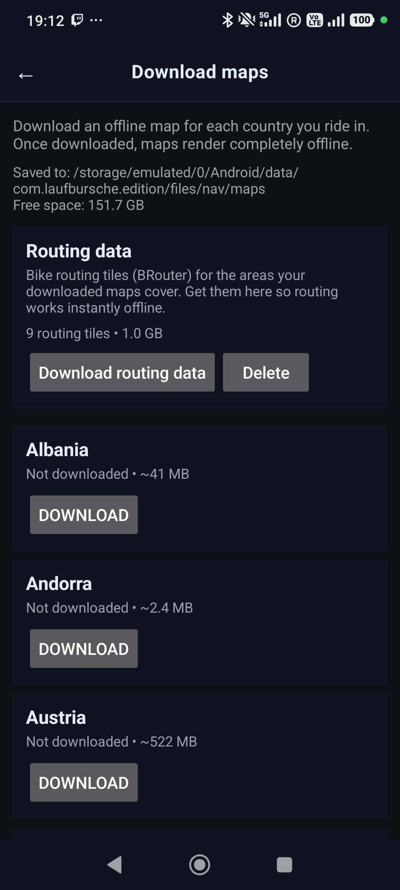</td>
  </tr>
  <tr>
    <td align="center">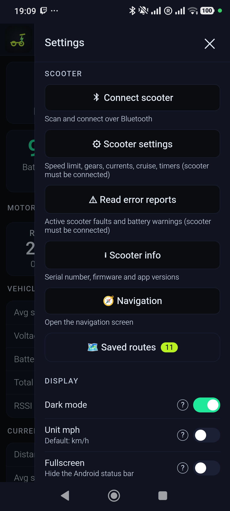</td>
    <td align="center">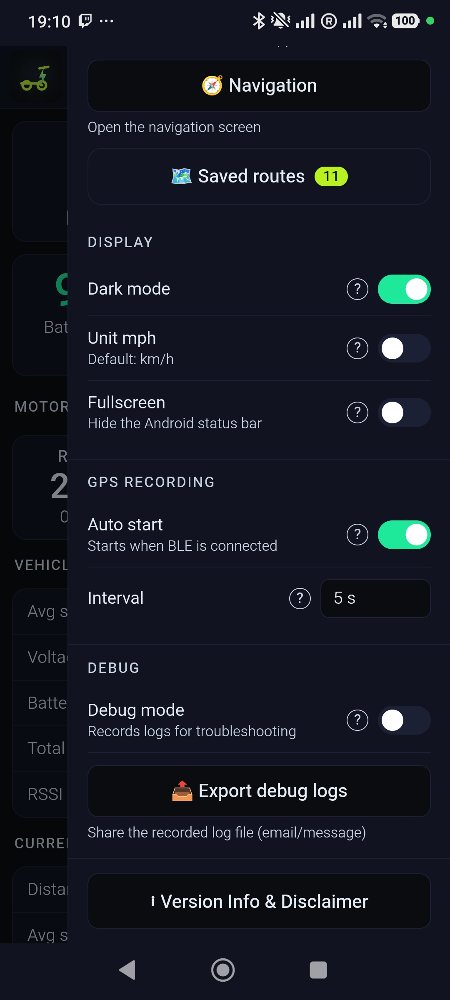</td>
    <td align="center">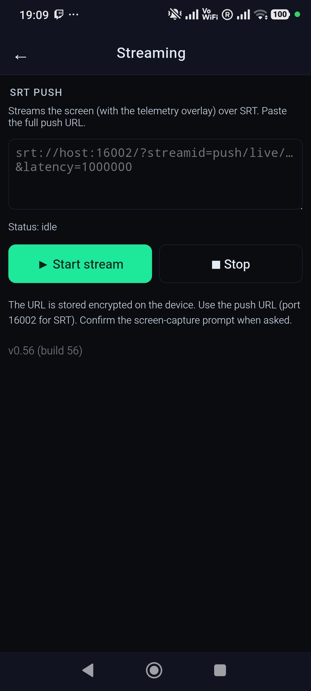</td>
  </tr>
</table>

## Installing the app

There are two ways to install the app. The normal one is a plain sideload from a file manager (below), which keeps working on every phone including Xiaomi/MIUI. A computer/ADB install is only a power-user fallback.

### Normal install (file manager)

Copy the `Laufbursche-Edition-vX.apk` file to your phone and open it in a file manager to install it. No PC and no cables are needed - offline maps are downloaded inside the app.

**Allow "install unknown apps" (Android 8 and newer).** Because the app does not come from the Play Store, Android must be allowed to install it. The first time you tap the downloaded APK, Android will ask you to let the app you opened it with (your file manager or browser) "install unknown apps" - enable that then tap the APK again to install. Alternatively you can pre-enable it under **Settings -> Apps -> [your file manager] -> Install unknown apps -> Allow**. This is only needed for the file-manager install path; the ADB path below does not need it.

### Installing after 2026 (the "advanced flow")

From 2026 Google is phasing in developer verification: on certified devices, in affected regions, an app whose developer has not verified their real-world identity can no longer be installed straight from a file manager without a one-time device opt-in. This app is distributed without a verified developer account (identity verification would expose the author's personal details), so on an affected device the user enables Android's "advanced flow" once. It is a per-device, one-time setup - nothing about it is per-app and nothing is required from the developer.

The one-time steps on the phone:

1. Turn on Developer mode: Settings -> About phone -> tap the build number 7 times.
2. Confirm you are not being talked through this by someone else (an anti-coercion check that blocks scam-driven installs).
3. Restart and re-authenticate - this cuts off any remote-access session or ongoing call an attacker might be using to watch along.
4. Wait out a one-time 24-hour "security wait" then confirm with your fingerprint/PIN that it is really you.
5. Done - you can now install apps from unverified developers from the file manager as usual. The installer still shows an "unverified developer" warning; tap "Install Anyway". You can allow this for 7 days or keep it on permanently.

Because it ships through Google Play services it is the normal file-manager path, not ADB, so it works on every phone including Xiaomi/MIUI - MIUI's separate ADB restriction is irrelevant here.

When it applies:

- The advanced flow itself becomes available around August 2026 through a Google Play services update, so if the option is not in your Developer options yet it simply has not rolled out to your device.
- Verification enforcement starts 2026-09-30 in Brazil, Indonesia, Singapore and Thailand and reaches most other regions (Germany included) in 2027 and later. Until it reaches your region, plain sideloading works unchanged and you do not need the advanced flow at all.

Sources: [9to5Google - the advanced flow, with screenshots](https://9to5google.com/2026/03/19/android-advanced-flow-sideloading/), [Google - developer verification FAQ](https://developer.android.com/developer-verification/guides/faq), [Help Net Security - rollout timeline](https://www.helpnetsecurity.com/2026/06/19/android-developer-verification-rollout-markets/).

### Installing via ADB

You can also install from a computer over ADB (Android platform-tools). This is mainly for developers; for normal use the file-manager route above is simpler and, on Xiaomi, the only friction-free option. Enable ADB once on the phone then install from the computer.

1. On the phone - enable it once:
   - Open Settings -> About phone and tap "Build number" 7 times to unlock Developer options.
   - Open Settings -> System -> Developer options and turn on "USB debugging".
   - Connect the phone to the computer by USB and confirm the "Allow USB debugging" prompt on the phone.
2. Install the APK from the computer:
   - `adb install -r Laufbursche-Edition-vX.apk` (the `-r` reinstalls/updates if a previous version is present).
   - If that fails because a different signature is installed, uninstall the old one first: `adb uninstall com.laufbursche.edition` then `adb install`.
   - On Xiaomi (MIUI/HyperOS) a fresh ADB install of a new app is blocked with `INSTALL_FAILED_USER_RESTRICTED` unless you first enable "Install via USB" in Developer options, which Xiaomi ties to a signed-in Mi account plus an online check (there is no account-free ADB bypass on stock firmware without root). On Xiaomi the file-manager route above is the easier path - only that avoids Xiaomi's ADB gate.
3. Where to get ADB (Android SDK Platform-Tools) - it is a small standalone download, no full Android Studio needed:
   - Official downloads: https://developer.android.com/tools/releases/platform-tools
   - Windows: download the "SDK Platform-Tools for Windows" zip, extract it then run `adb.exe` from a terminal opened in that folder (or add the folder to PATH).
   - macOS: download the "SDK Platform-Tools for Mac" zip and run `./adb` from the extracted folder or install via Homebrew: `brew install android-platform-tools`.
   - Linux: download the "SDK Platform-Tools for Linux" zip and run `./adb` or install your distro package (Debian/Ubuntu: `sudo apt install adb`; Arch: `sudo pacman -S android-tools`; Fedora: `sudo dnf install android-tools`).

## Privacy & data protection

The app collects **nothing** - no accounts, no analytics, no telemetry, no tracking and no ads. Everything stays on your device. The only network use is the **Bluetooth LE** link to your scooter plus **optional HTTPS downloads** of offline map and routing data from public OpenStreetMap mirrors and the **SRT screen stream** to a server URL you configure yourself. Nothing is ever sent to the developer or to any manufacturer backend.

See [PRIVACY.md](PRIVACY.md) for the full privacy policy.

## Permissions

The app requests only what it needs - see [PERMISSIONS.md](PERMISSIONS.md).

## Disclaimer & Trademarks

This is an independent, community project. It is not an official Teverun app and the developer ("Laufbursche") is not affiliated with, endorsed by or connected to Teverun. "Teverun" and other product names are trademarks of their respective owners; the name is used here only descriptively to indicate the scooters this app works with. See [TRADEMARKS.md](TRADEMARKS.md) for details.

# For developers

## Architecture

A native Java `Activity` hosts a `WebView` dashboard (`assets/dashboard/telemetry.html`) bridged to native code via a `@JavascriptInterface` object named `LB`. Native `BleManager`, `FrameParser`, `CommandBuilder` and `SettingsState` implement the UART-over-BLE VCU protocol (see the "BLE protocol reference" section below). Screen streaming lives in the `com.lb.srt` module. Offline navigation uses **Mapsforge** for maps and **BRouter** for routing, with a foreground-service downloader for on-demand map and routing-segment data.

## Getting the code

The project is tracked in git. A public remote is not published yet - it will be added later - so for now the repository is local. When a remote is available, clone it with the generic pattern:

```bash
git clone https://github.com/Laufbursche42/tr-lb-edition.git
cd tr-lb-edition
```

## Prerequisites

- **JDK 21** (JDK 17 also works). Point `JAVA_HOME` at your chosen JDK.
- **Android SDK** - the command-line SDK is enough. You need the `platform-tools` package plus the compile SDK the project builds against.
- **adb** ships inside the Android SDK platform-tools. It is only needed to install over USB (see [Installing via ADB](#installing-via-adb)); it is not required to build.

> **Version numbers - do not confuse them.** These are unrelated scales, so a higher or lower number in one does not say anything about "newer" or "older" in another (for example JDK 21 sitting next to minSdk 26 does not make 21 the older one):
>
> - **JDK 21** - the Java build tool (LTS). This is a Java version, unrelated to Android API levels. It is the version the Android build tooling (AGP/Gradle) officially supports; newer JDKs are not the supported baseline.
> - **compileSdk 36** - builds against Android 16 (the newest Android SDK).
> - **targetSdk 36** - targets Android 16.
> - **minSdk 26** - the OLDEST Android the app runs on (Android 8.0). This is a minimum/floor for device support, not "the version we use" - a lower minSdk means MORE phones are supported.
> - **Java language level 21** - the Java syntax the app source uses (compiled to Android).

## Building from source

Two build types are available. Debug is the quick everyday build; release is what you distribute publicly.

### Debug build

```bash
export JAVA_HOME=/path/to/jdk-21
./gradlew assembleDebug
```

The APK lands at `app/build/outputs/apk/debug/app-debug.apk`. It is signed automatically with Android's debug key (no keystore setup needed), it is debuggable, it is not optimized or minified. This is the build used for development and testing - the versioned test APKs are debug builds.

### Release build

```bash
./gradlew assembleRelease
```

The output lands in `app/build/outputs/apk/release/`. A release APK must be signed with your own keystore, so the freshly built APK is not installable until you configure signing. One-time setup:

1. Create a keystore once:

   ```bash
   keytool -genkeypair -v -keystore release.keystore -alias release \
     -keyalg RSA -keysize 2048 -validity 10000
   ```

2. Add a `signingConfigs { release { ... } }` block to `app/build.gradle`. Read the keystore path and passwords from a gitignored `keystore.properties` file so no secret is ever committed:

   ```properties
   # keystore.properties (DO NOT COMMIT)
   storeFile=release.keystore
   storePassword=your-store-password
   keyAlias=release
   keyPassword=your-key-password
   ```

3. Reference that signing config from `buildTypes.release` in `app/build.gradle`.
4. Build the signed APK with `./gradlew assembleRelease`.

Release builds are what you distribute publicly: optimized, shrinkable via `minifyEnabled`, signed with your own key. The keystore filename and alias shown here are just labels you can choose freely; only the keystore file itself and the passwords are secret and must stay private (gitignored, never committed).

### Debug vs release

| Aspect | Debug | Release |
|--------|-------|---------|
| Signing key | Android debug key (automatic) | your own keystore |
| Debuggable | yes | no |
| Optimization / minify | off | optional (on when `minifyEnabled true`) |
| Purpose | development / testing | public distribution |

Debug builds are only for local development and testing (fast iteration while developing). The builds that end users download from the GitHub Releases page are signed release builds, produced with the release build plus signing config described above and built by the release CI workflow - so users get a signed release, not a debug build. A release signing config is intentionally not committed - keystores must stay private and out of git (the pre-commit secret hook and `.gitignore` already block `*.jks` / `*.keystore` files).

## BLE protocol reference

The UART-over-BLE VCU wire protocol - frame layout, command set and settings model - is documented inline below. This documents the BLE protocol of the Teverun VCU as reverse-engineered from the [Official Teverun App](https://play.google.com/store/apps/details?id=uni.UNI2202FAB) (a uni-app bundle) and validated against the Teverun Fighter Mini Pro (eKFV) scooter. It covers all the frames and commands the original app uses, but it is not guaranteed to be exhaustive of everything the VCU firmware supports - the VCU may have frames or commands the app never uses (which are not visible from the app code), other scooter models may differ and some fields are marked as uncertain where noted.

### Transport summary

Proprietary UART-over-BLE, ISSC / Microchip Transparent UART profile. Not OBD/OBD2. Every application frame is exactly 20 bytes: a 1-byte sync/header, a 1-byte command id, 17 payload bytes and a trailing 1-byte CRC-8. Multi-byte numeric fields are big-endian, unsigned; signedness is emulated with fixed offsets (current -1000, temperature -40).

---

### 1. BLE connection

#### 1.1 UUIDs

| Role | UUID |
|------|------|
| Service | any primary service whose UUID (uppercased) `startsWith("0000FF")` or `startsWith("495353")` |
| Notify (VCU -> phone) | `49535343-1e4d-4bd9-ba61-23c647249616` |
| Write (phone -> VCU) | `49535343-aca3-481c-91ec-d85e28a60318` |

The scooter this app targets uses the ISSC Transparent UART service (`49535343-...`). The canonical 16-bit-style base for that service is `49535343-fe7d-4ae5-8fa9-9fafd205e455` (only the prefix `495353...` is matched in code - do not hard-code the full service UUID; discover it).

Characteristic selection logic:

```js
// r = stored serviceId
n.characteristics.forEach(function (e) {
  if (e.properties && e.uuid !== "") {
    if (r.startsWith("495353")) {                 // ISSC UART service
      notifyId = "49535343-1e4d-4bd9-ba61-23c647249616";  // hard-coded
      writeId  = "49535343-aca3-481c-91ec-d85e28a60318";  // hard-coded
    } else if (e.properties.notify) {
      notifyId = e.uuid;                           // 0000ffxx family: pick by property
    } else if (e.properties.write) {
      writeId  = e.uuid;
    }
  }
});
```

So: if the service is `495353...`, use the two hard-coded characteristic UUIDs above. Otherwise (a `0000FFxx` service) pick the characteristic that advertises the `notify` property as notify and the one that advertises `write` as write.

> A second, older service exists as a fallback for some older or other units: the Microchip RN487x data service, matched by a service UUID containing `0003CDD0` with characteristics `0003CDD2` (write) and `0003CDD1` (notify). It is not the active telemetry path; the live path is the ISSC service described above.

Connection identifiers worth persisting: `deviceId`, `name`, `serviceId`, `notifyId` and `writeId`.

#### 1.2 Scan / device identification

Scan for the scooter:

```js
uni.startBluetoothDevicesDiscovery({ allowDuplicatesKey: true, powerLevel: "high" });
// accept a discovered device if its name OR localName startsWith one of:
//   "XY", "T", "BT04"        (normal mode)
//   + "AWE072060A"           (only when openPush is set)
```

The scan accepts any device whose name (or localName) starts with one of the literal prefixes `XY`, `T` or `BT04` (plus `AWE072060A` when `openPush` is set). The single-character `T` prefix is deliberately broad: every Teverun model name begins with `T` (`T1...`, `T2...`, `TDE...`, `TAT...` and so on), so matching `T` catches all of them. This is only the scan filter - it does not classify the model.

Model / feature identification from the BLE advertised name happens after the GATT link is up and only sets client-side feature flags (for example the gear range and whether it is a v2 platform). It is not needed to communicate with the VCU.

The classification hinges on a single test, `name.startsWith("T2")`:

- Names starting with `T2` are the ver2 platform: `isVer2 = true`.
- Every other `T`-prefixed name (`T1...`, `TDE...`, `TAT...`, ...) is the non-ver2 / T1-class family: `isVer2 = false`. In particular `TDE` is a T1-class model precisely because it does not start with `T2` (the name is `TDE`, not `T2DE`); the same applies to `TAT`. So `T2` is the only ver2 prefix and it is not one option among several parallel model prefixes - it is the single discriminator that separates ver2 from the T1 class.

| Name prefix | isVer2 | Flags set | Notes |
|-------------|--------|-----------|-------|
| `T2...` | true | `minGear=0`, `maxGear=5`, `isSmartEnable=true` | ver2 platform; model from chars [7..8] |
| `T1...` | false | `isEcuDevice=true` | `T1IL...` -> `isIsraelEcuDevice=true` |
| `TDE...` or `TAT...` | false | `isTdeDevice=true`, `minGear=2`, `maxGear=4`, `isTdeInt=true` | eKFV region units; T1-class (no `T2` prefix) |
| (anything else) | false | `minGear=0`, `maxGear=5` | default (`SE` / "TEVERUN SPACE") |

> "INT" in the task brief refers to the flag `isTdeInt` ("international"), which is set `true` for `TDE` / `TAT` devices - it is not a BLE-name prefix. `isTdeTat` is set from the `TAT` prefix. These flags only affect app-side speed caps (see Section 2.5), which the LB patch removes.

The cosmetic model display name is derived from the BLE name using two cases, selected by the same `startsWith("T2")` test:

- For `T2...` names, chars [7..8] (`name.substring(7,9)`) map to a model:
  - `FM` -> FIGHTER MINI
  - `FP` -> FIGHTER MINI PRO
  - `FE` -> FIGHTER ELEVEN
  - `FU` -> FIGHTER ELEVEN+
  - `SU` -> SUPREM ULTRA
  - `SR` -> SUPREM 7260
  - `T2` -> TETRA 2 MOTOR
  - `T4` -> TETRA 4 MOTOR
- For all other names, chars [6..8] (`name.substring(6,9)`) map to a model:
  - `GTE` / `GTP` -> TEVERUN GT
  - `T20` -> TETRA 2 MOTOR
  - `T40` -> TETRA 4 MOTOR
  - `FTE` -> FIGHTER TEN
  - `FEE` / `FEP` -> FIGHTER ELEVEN
  - `SPP` -> SUPREME PLUS
  - `SPU` -> SUPREME ULTRA
  - `SPR` -> SUPREME 7260R
  - `BME` / `BMP` / `BMU` -> BLADE MINI
  - `FME` / `FMO` / `FMP` -> FIGHTER MINI
  - `BQE` / `BQP` -> BLADE Q
  - `FQ` -> FIGHTER Q
  - `SE` -> TEVERUN SPACE

This mapping is cosmetic (model display name) only.

> The advertised name is more than a label: it is the VCU's device-identity string, which is the scooter's FIN. It is stored in the VCU's I2C EEPROM config block (persisted), mirrored to RAM at boot and changeable at runtime over BLE with command 0x1f (Section 3.6) - no firmware flash, persisted to EEPROM, reversible. Its first three characters gate the firmware speed clamp: a name starting with `TDE` is the restricted eKFV marker (see the [Firmware](#firmware-reverse-engineering) section). Robust name resolution: on a non-bonded LE connection the advertised name is often empty, so the app also reads the GAP Device Name characteristic (service `0x1800`, characteristic `0x2A00`) right after connecting, plumbs the known name through its `connect(addr, name)` path and never persists an empty name.

#### 1.3 Connect, MTU, notifications

```js
uni.createBLEConnection({ timeout: 12000, deviceId });
// on success: after 1500 ms -> discover services
// on disconnect (connected == 0) -> reconnect
```

- MTU: some code paths request `setBLEMTU({ mtu: 511 })`, but frames are 20 bytes, so the default ATT MTU (23, 20-byte payload) is sufficient either way. Requesting a larger MTU is optional.
- Notify subscription / CCCD:

  ```js
  uni.notifyBLECharacteristicValueChange({
    type: "notification",           // notifications, NOT indications
    state: true,                    // enables the CCCD
    deviceId, serviceId, characteristicId: notifyId
  });
  uni.onBLECharacteristicValueChange(cb);   // receive handler
  ```

In native Java this means: enable local notifications with `setCharacteristicNotification(notifyChar, true)` and write the CCCD descriptor `00002902-0000-1000-8000-00805f9b34fb` with `ENABLE_NOTIFICATION_VALUE` (`0x01 0x00`).
- Handshake / keep-alive: the original app sends `sendConnectCode(0)` once after connecting and then every 6500 ms. The VCU streams telemetry frames continuously; there is no per-frame poll (`sendGetInfoCode` is defined but not called in that build). Sending the connect frame is what starts / sustains the stream.

---

### 2. Incoming telemetry frames (VCU -> phone)

#### 2.1 Receive pipeline

On each incoming notification:

```js
var t = i.buf2hex(value);          // -> ARRAY of 2-char lowercase hex byte strings, e.g. ["55","52",...]
var frames = [];
if (t.length > 20)                 // a single notification may hold several concatenated frames
  for (a = 0; a < t.length; a += 20) frames.push(t.slice(a, a + 20));
else frames.push(t);
frames.forEach(function (f) {
  if (validateCRC(f)) { /* dispatch on f[0], f[1] */ }
});
```

- `buf2hex` returns an array, one element per byte, each a 2-char hex string. Indexing `t[n]` = byte n. `t[2]+t[3]` = big-endian 16-bit hex string -> `parseInt(_,16)`.
- `validateCRC(e)`: rejects unless `e.length === 20`; CRC = `e[19]`, computed over `e[0..18]` with `getCrcCode(slice(0,19), 19, true)`. Drop the frame if CRC fails.
- Dispatch key: `f[0] === "55"` (sync) and `f[1]` = frame id.

#### 2.2 Bit-field helpers

| Helper | Behaviour |
|--------|-----------|
| `formattingBalStatus(byte)` | `parseInt(hex,16)` -> 8-bit binary -> array, then reversed -> index [0] = bit0 (LSB) ... [7] = bit7 (MSB) |
| `formatLevel(byte)` | returns `[highNibble, lowNibble]` = `[bits7..4, bits3..0]` |
| `getSleepAndPrTime(byte)` | `{ sleepTime: byte & 0x07, prTime: (byte >> 3) & 0x1F }` |

#### 2.3 Version / identity frames

| Frame | Field(s) | Bytes -> value | Var |
|-------|----------|----------------|-----|
| `55 41` | Battery serial | `t[2..16]` (15 bytes) ASCII, trimmed; prefix `"AW"` if missing | `batCode` |
| `55 42` | VCU frame number | `t[2..18]` (17 bytes) ASCII | `frameNum` |
| `55 43` | VCU SW / HW | if `t[2]>0`: `swVer = t[2].t[3].t[4]` (decimal). Smart-capable if `3 <= t[3] <= 10`. if `t[6]>0`: `hwVer = t[6].t[7].t[8]` | `swVer`, `hwVer` |
| `55 44` | Display / Battery / LC fw | `t[2]`=disProType, `t[3]`=disProCode, `t[4].t[5].t[6]`=display SW; `t[8]/t[9]`+`t[10..12]`=battery; `t[14]/t[15]`+`t[16..18]`=LC. (`FF FF FF` -> `-.-.-`) | - |
| `55 45` | Main / secondary ctrl | `t[2]/t[3]`+`t[4..6]`=rear-main ver; `t[8]/t[9]`+`t[10..12]`=front-main ver | - |
| `55 4D` | Rear / front ctrl (4-motor) | `t[2]/t[3]`+`t[4..6]`=RR ver; `t[8]/t[9]`+`t[10..12]`=RF ver | - |

> The scooter's identity string (its FIN, used as the BLE advertised name) is not one of these telemetry frames. It is read from the advertised name or the GAP Device Name characteristic (Section 1.2) and can be changed with command 0x1f (Section 3.6). Its first three characters (`TDE` on an eKFV unit) gate the firmware speed clamp - see the [Firmware](#firmware-reverse-engineering) section.

#### 2.4 Live telemetry frames

`parseInt(...,16)` is implied for every raw value.

##### `55 52` - Battery voltage / current / SOC / temperatures

| Bytes | Formula | Var / dashboard field | Unit |
|-------|---------|-----------------------|------|
| `t[2]+t[3]` | `raw * 0.1` | `VolPack` (pack voltage) | V |
| `t[4]+t[5]` | `raw * 0.1` | `poleVol` | V |
| `t[6]+t[7]` | `raw * 0.1 - 1000` | pack current; < 0 = regeneration | A |
| `t[8]` | `raw` | `SOC` | % |
| `t[9]` | `raw * 0.01 * 100` (= `raw`) | `soh` | % |
| `t[10]...t[16]` | `raw - 40` | battery temps 1-7 | C |
| `t[17]` | `raw - 40` | max cell temp | C |
| `t[18]` | `raw - 40` | min cell temp | C |

##### `55 53` - BMS relays / capacity / cell voltages

| Bytes | Formula | Var | Unit |
|-------|---------|-----|------|
| `t[2]` | `raw` | `relay1` | bool |
| `t[3]` | `raw`; if `!= ff` -> `batteryStatus = formattingBalStatus(t[3])` | `relay2` | bool |
| `t[4]` | `raw` | `relay3`; also `charMode` | - |
| `t[5]` | `raw` | `chrMosState` | - |
| `t[6]` | `raw` | `dischrMosState` | - |
| `t[7]` | `formattingBalStatus` | `balState0` (bitfield) | - |
| `t[8]+t[9]` | `raw` (non-Ver2) | capacity | Ah |
| `t[10]+t[11]` | `raw` (isVer2) | capacity | Ah |
| `t[12]+t[13]` | `raw` | `chargeCounter` | cycles |
| `t[14]` | `raw` | `VolListLength` (cell count) | - |
| `t[15]+t[16]` | `raw` | max cell voltage | mV |
| `t[17]+t[18]` | `raw` | min cell voltage | mV |

##### `55 54` - Error codes / charge status

| Bytes | Meaning |
|-------|---------|
| `t[2..18]` | error array `d`: loop index `h` = error type, `value = parseInt(d[h],16)` = severity. `value>0` -> `uploadWarnData(h, min(value,3))`. |
| `t[17]` | `chargeStatus` (charge-image index) |

`hasWarnInfo` aggregation: any error severity `>2` (except index 16) => `2`; else index 0 or 2 with severity `>1` => `1`; else `0`.

##### `55 71` - Main control: gear / limits / system status

| Bytes | Formula | Var / store | Unit |
|-------|---------|-------------|------|
| `t[3]` | `raw` | `gear` | 1-5 |
| `t[4]` | `formattingBalStatus` | `rControlStatus` (bitfield) | - |
| `t[5]` | `raw` | `motorPolePairs` | - |
| `t[6]` | `raw * 0.1` | `wheel` (wheel size, internal unit) | - |
| `t[7]` | `raw` | `sysProTemp` (protection temp) | C |
| `t[8]` | `formatLevel` | assist byte 1: `[1]`=`fStartLevel` (low nibble) | - |
| `t[9]` | `formatLevel` | assist byte 2: `[0]`=`eabsLevel` (high nibble), `[1]`=`rStartLevel` (low nibble) | - |
| `t[10]` | `raw` | assist `speedLimit` (per-gear) | km/h |
| `t[11]` | `raw` | main `speedLimit` | km/h |
| `t[12]` | `raw` | `fCurrent` | - |
| `t[13]` | `raw` | `rCurrent` | - |
| `t[15]` | `raw` | `packVolt` | V |
| `t[16]` | `formattingBalStatus` | `fControlStatus` (bitfield) | - |
| `t[17]` | `formattingBalStatus` | `systemStatus` (bitfield, see below) | - |
| `t[18]` | `getSleepAndPrTime` | `sleepTime` = `t[18]&7`, `prTime` = `(t[18]>>3)&31` | - |

`systemStatus` bits (`t[17]`, LSB-first): `[0]`=eco/`enfEcon`, `[1]`=`isUnitMile`, `[2]`=`atMode`, `[4]`=`isSmart`, `[5]`=reverse gear, `[6]`=hardware flag (TDE), `[7]`=DV/monitor.

This frame reports only the CURRENTLY active gear (`t[3]`) together with that gear's per-gear/assist values (`t[8]`-`t[13]`). There is no bulk read of all gears, so to populate every gear's values in the editor the scooter has to be switched through each gear once (the app caches them per session in memory only, never on disk). On eKFV (TDE) units the internal gears 2/3/4 map to 1/2/3 on the scooter display.

`rControlStatus` bits (`t[4]`, LSB-first): cruise level = `(bit2 << 1) | bit1` (`parseInt(rControlStatus[2]+rControlStatus[1],2)`), `[3]`=ABS, `[6]`=`startMode` (launch).

##### `55 72` - Motor: current / temp / ECU status / raw speed

| Bytes | Formula | Var | Unit |
|-------|---------|-----|------|
| `t[2]` | `formattingBalStatus` | `fEcuStatus1` (bitfield) | - |
| `t[3]` | `formattingBalStatus` | `fEcuStatus2` (bitfield); `[3]` = `doubleMotor` | - |
| `t[4]+t[5]` | `raw * 0.1` | `fMotorCurrent` (front) | A |
| `t[9]` | `raw` (kept only if `>0`) | `fMotorTemp` (front) | C |
| `t[10]` | `formattingBalStatus` | `ecuStatus1` (bitfield) | - |
| `t[11]` | `formattingBalStatus` | `ecuStatus2` (bitfield); `[3]` = `rmStatus`, `[4]`=headlight, `[5]`/`[6]`=turn signals | - |
| `t[12]+t[13]` | `raw * 0.1` | `rMotorCurrent` (rear) | A |
| `t[15]+t[16]` | `raw` | `speed` (raw speed) | raw |
| `t[17]` | `raw` (kept only if `>0`) | `rMotorTemp` (rear) | C |
| `t[18]` | `formattingBalStatus` (if `!= ff`) | `systemStatus3` (bitfield) | - |

`ecuStatus1` bits: `[0]`=brake fault, `[2]`=warning type2 (tail-light), `[3]`=warning, `[4]`=warning2, `[7]`=park (P). `ecuStatus2` bits: `[0]`=cruise active, `[3]`=`rmStatus`, `[7]`=park (P).

##### `55 73` - Ride: avg/max speed / distance / energy

| Bytes | Formula | Var | Unit |
|-------|---------|-----|------|
| `t[2]+t[3]` | `raw * 0.1` | `avgSpeed` | km/h |
| `t[4]+t[5]` | `raw * 0.1` | `maxSpeed` | km/h |
| `t[6]+t[7]` | `raw * 0.1` | `singleMile` (trip) | km |
| `t[8]+t[9]+t[10]` | `raw` (3 bytes, BE) | `totalMile` (odometer) | km |
| `t[11]+t[12]` | `raw * 0.1` | `enFeedBack` (cumulative regen) | unit unverified |
| `t[16]` | `formattingBalStatus` (if `!= ff`) | `systemStatus2`: `[0]`=batLock, `[1]`=gpsLock; `(bit7<<1)|bit6` -> power popup | - |
| `t[17]` | `raw` | `customKey` (current custom-key function) | - |
| `t[18]` | `formattingBalStatus` (if `!= ff`) | `[3]`=PowerMode, `[4]`=LightSens, `[5]`=Voice, AtLevel=`(bit7<<1)|bit6` | - |

##### `55 79` - 4-motor control status (Tetra)

`t[4]` -> `rrControlStatus`, `t[16]` -> `rfControlStatus` (both `formattingBalStatus`).

##### `55 7A` - 4-motor rear/front (Tetra)

| Bytes | Formula | Var | Unit |
|-------|---------|-----|------|
| `t[2]` | `formattingBalStatus` | `rfEcuStatus1` | - |
| `t[4]+t[5]` | `raw * 0.1` | `rfMotorCurrent` | A |
| `t[9]` | `raw` (if `>0`) | `rfMotorTemp` | C |
| `t[10]` | `formattingBalStatus` | `rrEcuStatus1` | - |
| `t[12]+t[13]` | `raw * 0.1` | `rrMotorCurrent` | A |
| `t[17]` | `raw` (if `>0`) | `rrMotorTemp` | C |

#### 2.5 Derived values

Real speed:

```
realSpeed_kmh = 287 * wheel / speed_raw          // wheel = 55 71 t[6]*0.1
realSpeed_mph = realSpeed_kmh / 1.6093439
if (speed_raw >= 3000 || realSpeed <= 0.5) realSpeed = 0
```

`realSpeed` is stored in mph when `isUnitMile`, else km/h. (App-side region caps - `isTdeTat` -> 25, `isTde && !isTdeInt` -> 22 - are applied here and in `55 73`; the LB patch removes them. A native implementation should ignore those caps.)

Power:

```
single motor: power_kW = rMotorCurrent * VolPack / 1000
dual motor:   power_kW = (rMotorCurrent + fMotorCurrent) * VolPack / 1000
```

Live regeneration: from `55 52` current = `t[6]+t[7]` * 0.1 - 1000; `current < 0` => regen, `|current|` = fed-back current [A].

#### 2.6 Dashboard field name reference

The values decoded from the telemetry frames are `realSpeed`, `avgSpeed`, `maxSpeed`, `SOC`, `soh`, `VolPack`, `poleVol`, `power`, `rMotorCurrent`, `fMotorCurrent`, `rMotorTemp`, `fMotorTemp`, `singleMile`, `totalMile`, `enFeedBack`, `gear`, `speedLimit`, `chargeCounter`, `customKey`, the status bit-arrays `systemStatus[]`, `ecuStatus1[]`, `ecuStatus2[]`, `rControlStatus[]` and `fControlStatus[]`, plus `doubleMotor` and `rmStatus`. Battery temperatures, cell voltages and capacity are decoded from the frames too (the original app stores that battery detail in its own internal `topList[]` / `bottomList[]` arrays - those arrays are internal to that app, not part of the protocol). GPS lat/lon/speed and RSSI are phone-side (read from the phone via `uni.getLocation` and `uni.getBLEDeviceRSSI`), not in the VCU frames.

---

### 3. Outgoing commands (phone -> VCU)

#### 3.1 Frame format & CRC

Every command is a 20-byte frame:

```
[0]  0xAA (170)  header/sync
[1]  cmdId
[2..18]  17 payload bytes (default 0xFF)
[19] CRC-8
```

CRC-8 (`getCrcCode`):

```js
getCrcCode(arr, len, hexInput = true) {
  let crc = 0;
  for (let a = 0; len--; a++) {
    crc ^= hexInput ? parseInt(arr[a], 16) : arr[a];
    for (let n = 8; n > 0; --n)
      crc = (crc & 0x80) ? ((crc << 1) ^ 0x07) : (crc << 1);
    crc &= 0xFF;
  }
  return crc.toString(16).padStart(2, "0");
}
```

- Polynomial `0x07`, init `0x00`, MSB-first, no input/output reflection, no final XOR.
- Computed over the first 19 bytes (`[0..18]`); result placed at `[19]`.
- Outgoing builders call it with `hexInput = false` (array holds numbers); the incoming `validateCRC` calls it with `hexInput = true` (array holds hex strings). Same algorithm.

Send path: `CRC(arr)` appends the CRC byte, maps every element to a 2-char hex string, then `sendcode` -> `writeBLECharacteristicValue`.

Write (`writeBLECharacteristicValue`): takes the 40-char hex string, builds an `ArrayBuffer` of `len/2` bytes via `DataView.setUint8(i, "0X"+pair)` and writes the whole 20-byte frame in one `uni.writeBLECharacteristicValue`. On failure it retries up to 4x. Write type is the uni default (with response); the ISSC write characteristic also supports write-without-response - verify preferred write type on device.

#### 3.2 Generic builder - `setControlCode(cmdId, overrides)`

`setControlCode`:

```js
setControlCode(cmdId, overrides = []) {   // overrides: [{index, value}, ...]
  let r = [170, 1, 255,255,255,255,255,255,255,255,255,255,255,255,255,255,255,255,255];
  r[1] = cmdId;
  overrides.forEach(o => r[o.index] = o.value);
  uni.vibrateLong();
  this.CRC(r);   // appends CRC-8, sends 20-byte frame
}
```

#### 3.3 Command id map

| cmdId (dec / hex) | Builder | Purpose | Key payload |
|-------------------|---------|---------|-------------|
| 1 / 0x01 | `sendGetInfoCode(e)` | request info (defined, not called in this build) | `[2]=e` |
| 1 / 0x01 | `sendConnectCode(e=0,...)` | handshake / keep-alive (every 6.5 s) | `[2]=16 (0x10)`, `[3]=e`, `[4..7]=params(255)` |
| 2 / 0x02 | `setControlCode(2,...)` | control; deep sleep = `[{index:11,value:1}]` | `[11]` |
| 3 / 0x03 | `setControlCode(3,...)` | charge mode = `[{index:16,value:mode}]` | `[16]` |
| 8 / 0x08 | `sendLedSettingCode` / `...2` | LED on/off, RGB, mode | `[2]`=on, `[4..6]`=RGB, `[3]`=mode, `[7]` |
| 24 / 0x18 | `sendSettingCode` | full settings write (see Section 3.4) | whole frame |
| 26 / 0x1A | `setControlCode(26,...)` | custom-key function = `[{index:6,value:N}]` | `[6]` = key id (Section 3.5) |
| 28 / 0x1C | `setControlCode(28,...)` | RTC time sync | `[2]=year%100,[3]=month(1-12),[4]=day,[5]=hour,[6]=min,[7]=sec` |
| 31 / 0x1F | `sendBtNameCode` | set BLE name / VCU identity (see Section 3.6) | `[2..17]` = 16 ASCII name bytes |

`sendConnectCode(0)` therefore serializes to: `AA 01 10 00 FF FF FF FF FF ... FF <CRC>`.

#### 3.4 `sendSettingCode` - full settings write (cmd 0x18)

`sendSettingCode(state, n = 0, r = 1)`. Base array is `a = [170, 24]` followed by seventeen `255` bytes; then:

| Index | Value | Meaning |
|-------|-------|---------|
| `a[0]` | `170` (0xAA) | header |
| `a[1]` | `24` (0x18) | cmdId |
| `a[2]` | `n` | write mode: `0` normal, `2` immediate (used by motor toggle & charge). When `n==2`, `a[3]` is overwritten with `r`. |
| `a[3]` | `gear` (`o`; TDE: gear 4 -> 5) | current gear / (when `n==2`) the assist-level index `r` |
| `a[4]` | `bytesToInt(s)` | rControlStatus byte - see bit map below |
| `a[5]` | `motorPolePairs` | |
| `a[6]` | `wheel * 10` | wheel size |
| `a[7]` | `sysProTemp` | protection temp |
| `a[8]` | `bytesToInt2(u)` | assist byte 1: high nibble = `eabsLevel`, low nibble = `fStartLevel` |
| `a[9]` | `bytesToInt2(l)` | assist byte 2: high nibble = `eabsLevel`, low nibble = `rStartLevel` |
| `a[10]` | `c.speedLimit` | per-gear/assist speed limit |
| `a[11]` | `state.speedLimit` | main speed limit |
| `a[12]` | `c.fCurrent` | front current limit |
| `a[13]` | `c.rCurrent` | rear current limit |
| `a[14]` | voltage code (from `packVolt`) | see voltage-code table below |
| `a[15]` | `packVolt` | pack nominal voltage (36/48/52/60/72/84) |
| `a[16]` | `bytesToInt(d)` | flag byte - see bit map below |
| `a[17]` | `bytesToInt(s)` (with `s[7]=doubleMotor`) | fControlStatus byte - bit7 = `doubleMotor` |
| `a[18]` | `(prTime << 3) | sleepTime` | sleep / power-off timer (`setSleepAndPrTimeCode`) |
| `a[19]` | CRC-8 | appended by `CRC()` |

`a[14]` voltage code, derived from `packVolt`:

| packVolt | code |
|----------|------|
| 36 | 30 |
| 48 | 39 |
| 52 | 42 |
| 60 | 48 |
| 72 | 60 |
| 84 | 69 |

`a[16]` flag byte `d[]` (`bytesToInt`, LSB-first - index0 = bit0):

| Field | `d[]` index | Bit / mask |
|-------|-------------|-----------|
| `enfEcon` (eco) | `d[0]` | `0x01` |
| `isUnitMile` | `d[1]` | `0x02` |
| `atMode` | `d[2]` | `0x04` |
| `isSmart` | `d[4]` | `0x10` |

`a[4]` / `a[17]` control bytes `s[]` (`bytesToInt`, LSB-first):

| Field | `s[]` index | Notes |
|-------|-------------|-------|
| cruise | `s[0]`, `s[1]`, `s[2]` | `cruise==2` (auto) -> `s[2]=1` (bit2); `cruise==1` (manual) -> `s[0]=1, s[1]=1` (bits0,1); `0` -> none |
| `abs` | `s[3]` | |
| `startMode` | `s[6]` | launch mode |
| `rmStatus` | `s[7]` | for `a[4]` only - rear-motor status |
| `doubleMotor` | `s[7]` | for `a[17]` only - `s[7]` is re-assigned to `doubleMotor` before computing `a[17]` |

> `bytesToInt(arr)` reverses then `parseInt(join,2)` -> index 0 = LSB. `bytesToInt2(arr)` does not reverse -> index 0 = MSB (used for the assist nibbles).

Multi-frame behaviour: unless `isEcuDevice`, `sendSettingCode` re-sends itself for `r = 1..5` at `200*r` ms intervals - one frame per assist/gear profile. A native implementation that only changes one setting can send a single frame with the correct `r`/gear.

#### 3.5 Custom-key function values (`keys[]`)

`keys[]` array:

| Value | Function |
|-------|----------|
| 1 | Motor |
| 2 | Kick Start |
| 3 | Auto Cruise |
| 4 | Limit Speed |
| 5 | Lock Scooter |
| 6 | TCS |
| 7 | Led Switch |
| 8 | Led Mode Switch |
| 9 | Turbo |
| 10 | Manual Cruise |
| 11 | EABS |

Assign a function to the physical custom key with:

```
setControlCode(26, [{ index: 6, value: N }]);   // N from the table
// -> AA 1A FF FF FF FF <N> FF FF ... FF <CRC>
```

The current assignment is reported back in `55 73` `t[17]` (`customKey`).

#### 3.6 Identity / device-name change (cmd 0x1f)

The BLE advertised name is the VCU's device-identity string - the scooter's FIN - held in the VCU I2C EEPROM config block and mirrored to RAM (Section 1.2). Command 0x1f rewrites it at runtime. The frame is the usual 20 bytes:

```
[0]      0xAA        header / sync
[1]      0x1F        cmdId
[2..17]  16 bytes    new identity, ASCII (padded / truncated to 16)
[18]     0xFF        unused
[19]     CRC-8       over [0..18]
```

The controller writes the new identity to EEPROM, so it survives a reboot; it needs no firmware flash and is fully reversible by sending the original name back. The app exposes this as `setDeviceName` / `setBleName`, surfaced as the "Change identity" row in Scooter Info, where the full FIN is editable with a Set button. The app never persists an empty name.

The first three characters of this identity gate the eKFV speed clamp: a name starting with `TDE` is the restricted eKFV marker, while the firmware factory default `AWPE-VCU-220212` is unrestricted. Changing the identity flips Gate 1 of the speed clamp but not Gate 2 (the display), so a name change alone does not raise the top speed. See the [Firmware](#firmware-reverse-engineering) section for the full picture.

---

### 4. Motor enable / disable (single vs dual, drive mode)

User action - `changeMotor()` cycles the drive mode and then writes the full settings frame with `n=2`:

```
current (rmStatus, doubleMotor)          next state
------------------------------------     ----------
dual  (rmStatus=1, doubleMotor=1)  ->    rear-only  (rmStatus=1, doubleMotor=0)
rear-only                          ->    front-only (rmStatus=0, doubleMotor=1)
front-only                         ->    dual       (rmStatus=1, doubleMotor=1)
then: sendSettingCode(state, 2);         // cmd 0x18, mode 2
```

On the wire (write, cmd 0x18):

- `a[4]` bit 7 = `rmStatus` (rear motor active)
- `a[17]` bit 7 = `doubleMotor` (dual / front motor active)

Read-back (cmd 0x72):

- `doubleMotor` = `fEcuStatus2[3]` = bit 3 of `t[3]`
- `rmStatus` = `ecuStatus2[3]` = bit 3 of `t[11]`

> Caution - verify on device. The write encodes these two flags in bit 7 of control bytes `a[4]` / `a[17]`, whereas the read-back decodes them from bit 3 of different status bytes in the `55 72` frame. They are distinct bytes in distinct frames, so there is no direct contradiction, but the exact controller-side bit position for commanding single vs. dual motor should be confirmed against a live VCU. There is no dedicated "motor" opcode - motor mode is only ever changed through the full settings write (cmd 0x18); the "Motor" custom key (value 1, Section 3.5) merely maps the hardware button to this same toggle.

`motorPolePairs` (`a[5]` out / `55 71` `t[5]` in) is a motor parameter, not an enable flag.

---

### 5. Implementation notes (for the Java layer)

- Endianness: all multi-byte numeric fields are big-endian (`hex[n] + hex[n+1]` in stream order, high byte first). `55 73 totalMile` is a 3-byte BE value (`t[8]+t[9]+t[10]`).
- Signedness: every raw value is treated as unsigned; negative results come from fixed offsets - current `raw*0.1 - 1000`, all temperatures `raw - 40`. There are no two's-complement fields.
- Byte representation: the JS works on arrays of 2-char hex strings. In Java, index the raw `byte[]` directly and mask with `& 0xFF`. Frame = `byte[20]`.
- Frame gating: only accept a 20-byte frame whose CRC-8 (poly `0x07`, init `0x00`, MSB-first) over bytes `[0..18]` equals byte `[19]`. Drop otherwise. A single BLE notification may contain several concatenated 20-byte frames - split every 20 bytes before validating.
- Dispatch: incoming header byte `[0] = 0x55`; command in `[1]`. Outgoing header `[0] = 0xAA`; command in `[1]`; CRC in `[19]`.
- Bit order: `formattingBalStatus` and outgoing `bytesToInt` are LSB-first (array index 0 = bit 0). `bytesToInt2` (assist nibbles) is MSB-first. `formatLevel` splits a byte into `[high nibble, low nibble]`.
- Notifications, not indications (`type:"notification"`): enable local notify + write CCCD `0x2902` = `0x01 0x00`.
- Startup sequence: connect -> discover services (pick primary `0000FF...` / `495353...`) -> discover characteristics (notify/write per Section 1.1) -> enable notifications (CCCD) -> send `sendConnectCode(0)` and repeat every ~6.5 s. Telemetry then streams unsolicited; no per-frame request is needed.
- Writes: send the complete 20-byte frame in a single GATT write; retry a few times on failure. Serialize concurrent writes (the original app spaces its multi-frame settings writes ~200 ms apart).
- Uncertain items (flagged above): (a) exact controller bit for single/dual-motor commanding - see Section 4; (b) `enFeedBack` physical unit - unverified; (c) preferred write type (with vs. without response) - the default is with-response.

## Firmware (reverse engineering)

This section documents what was found by reverse-engineering the scooter's own firmware - the VCU controller and the display - as distinct from the BLE app protocol above. It explains why the 22 km/h eKFV speed limit cannot be lifted over Bluetooth alone, what the app can and cannot change and where the remaining limits actually live. It is a research and educational record of how the hardware works; read the legal and safety note at the end before acting on any of it. Findings are firmware-verified for the eKFV (TDE) Fighter Mini Pro line unless noted otherwise.

### The double-gated 22 km/h speed clamp

On an eKFV unit the VCU firmware clamps the motor speed to 22 km/h (`0x16`). A single internal flag controls the clamp; that flag is the OR of two independent gates:

```
clamp_active = (VCU identity[0..2] == "TDE")  OR  (display 0x4c / 0x35 frame, byte6 bit2 set)
```

When the flag is set, the four motor-command frame builders each force the speed byte down to 22 whenever the requested speed is higher. Because the two gates are ORed, BOTH have to be off for the clamp to disappear. This is the key result: changing the identity name alone does not raise the speed, because the display keeps asserting its own gate. A real de-restriction has to defeat both gates.

### Gate 1 - VCU identity

The VCU identity string is the same value the scooter advertises as its Bluetooth name (its FIN). It lives in the VCU's external I2C EEPROM config block and is mirrored into RAM at boot. If its first three characters are `TDE` the eKFV region restriction is latched on. The factory-default identity baked into the firmware image is `AWPE-VCU-220212`, which does not start with `TDE`, so a fresh controller is unrestricted; the per-unit `TDE` marker is what a factory writes to enable the eKFV limit.

This gate is changeable at runtime over BLE with command id 0x1f (see [Section 3.6](#36-identity--device-name-change-cmd-0x1f)). It is written to EEPROM, so it survives a reboot, needs no firmware flash and is fully reversible by writing the old name back. This was confirmed on a real eKFV / TDE unit: setting a non-TDE name showed the new name after reconnect and persisted across a scooter power cycle.

### Gate 2 - the display clamp bit

The eKFV display firmware sets the clamp bit - byte6 bit2 of the `0x4c` / command-`0x35` frame it sends to the VCU - unconditionally. Its frame builder asserts that bit on every frame, with no menu, setting or key combination to turn it off, so from the VCU's point of view the display gate is always on regardless of the identity.

The exact fix is a one-byte patch to the display application image. At image offset `0x1729e` the instruction `orr r1, r1, #4` (bytes `41 f0 04 01`) becomes `bic r1, r1, #4` (bytes `21 f0 04 01`), which clears the bit instead of setting it. This is the only site that controls that bit; the display recomputes the frame checksum at runtime, so the VCU still accepts the modified frame.

There is NO no-flash unlock for Gate 2 on this firmware. A magic word (`0xAA55AA55`) written to a display flash config page only toggles a display-internal lock flag; it does not change the transmitted frame, because the frame builder re-asserts the bit on every frame. That word is not writable over NFC either, so the aftermarket de-restriction NFC chips sold for other displays do not work here - those displays have a conditional frame builder, whereas the eKFV display forces the clamp bit in the frame itself.

### Removing the clamp in VCU firmware

Patching the display is one option; the other is to patch the VCU application firmware, which defeats both gates at once. Each of the four motor-command frame builders clamps the speed byte to 22 with a `movs r7, #0x16` that runs after a compare. Replacing those four instructions with NOPs removes the clamp entirely, after which the natural per-gear speed passes through.

A patched image needs its CRC-16/MODBUS recomputed and its `:07AAA555` header record rebuilt. The bootloader checks only the CRC and the address range - there is no signature - so a correctly re-checksummed patched image is accepted.

Important caveat: these offsets are for the R5.4.19 image. A unit running R5.4.21 has different offsets and no 5.4.21 image is available, so patching a 5.4.21 unit requires re-locating the four clamps in the correct image first. There is also a recovery risk: flashing is one-way because the firmware cannot be read back over BLE (see the next subsection), so a known-good image for the exact version on the scooter is the only safety net before any flash.

### VCU bootloader OTA and firmware read-back

The VCU bootloader exposes exactly five write commands over the OTA protocol - START, FINISH, INFO, PACKINFO and PACKDATA (ids `0x710` to `0x714`). Integrity is a CRC-16 (polynomial `0x8005`) only; there is no signature check.

Crucially there is no read-back, dump or memory-read command. Full decompilation of the bootloader confirms a single command dispatcher with a whitelist of just those five ids and no read path, so the VCU firmware cannot be extracted over BLE - this is proven, not merely assumed. The bootloader's RDP-unprotect routine is present but is dead code with no caller. Reading the firmware out requires hardware SWD / JTAG on the controller board. The practical consequence is that a flash is one-way: there is no way to make a byte-exact backup of the running firmware over Bluetooth first.

### Display firmware flashing

The display has its own UART bootloader. It accepts an image with only a CRC-16 integrity check (polynomial `0x8005`, init `0xFFFF`) - no model, version or signature gate - and it writes only display flash; the controller is never touched. It is recoverable rather than a one-way brick: the application-valid magic is committed only after a CRC plus read-back verify, the bootloader region itself is never erased and a failed flash simply leaves the bootloader waiting for a new image.

Protocol: an enter-update handshake (`11 22 33 44 55 66 77 88` followed by a mode byte) then block-write frames (`0x88` header, big-endian destination offset, CRC-16 over the payload) or equivalently START / DATA / FINISH commands.

Critical constraint on this unit: the stock VCU application firmware has NO display-OTA relay. The display is a UART device on USART3, the CAN bus is the BMS bus and the VCU app has no handler for the display-OTA command group. So a display image cannot be delivered as a pure-BLE app -> VCU -> display relay; reaching the display bootloader requires a direct UART connection to the display line. The original Teverun app does expose a display update, but it is gated to the "ver2" platform, so a TDE / eKFV unit cannot use it. In that app the display image format is Intel-HEX with a `:07AAA555` trailer record (uId, proId, version, CRC-16/MODBUS); a raw `.bin` is rejected.

### Region write-protection - locked vs free settings

When the identity is `TDE` the VCU latches a country / region write-protection. The app can display every setting the controller supports, but the controller silently refuses to store the protected ones. The table below is firmware-verified for the eKFV (TDE) Fighter Mini Pro.

| Setting | State | Where the limit lives |
|---------|-------|-----------------------|
| Main speed limit + per-gear speed | Locked | hard-capped to 22 km/h by the VCU motor-frame builders |
| Cruise control (Tempomat) | Locked | VCU write-protects it (it keeps the old control-byte bits) |
| Wheel size | Locked | VCU never applies the value |
| Motor pole pairs | Locked | VCU never applies the value |
| Front current limit | Locked | forced to 0 by the separate motor-controller (ESC) firmware, unreachable from the app |
| Rear current limit | Locked | forced to 0 by the separate motor-controller (ESC) firmware, unreachable from the app |
| ABS | Free | works normally |
| Start / launch mode | Free | works normally |
| Front start level | Free | works normally |
| Rear start level | Free | works normally |
| EABS level | Free | works normally |
| Protection temperature | Free | works normally |
| Pack voltage | Free | works normally |
| Eco | Free | works normally |
| Units (km / mph) | Free | works normally |
| Anti-theft (electronic lock) | Not functional on eKFV | no GPS/immobilizer module; the app arms it only on T2 models and the controller has no handler for the toggle, so it does nothing here |
| Smart / TCS | Free | works normally |
| Gear selection | Free | works normally |
| Motor mode | Free | works normally |

The speed cap and the cruise lock are direct eKFV region protections latched by the `TDE` identity. Wheel size and motor pole pairs are simply never applied by this VCU - a structural limitation that manifests as a lock on TDE units. The two current limits are enforced one layer deeper, in the motor-controller (ESC) firmware, so no app can reach them; the VCU forwards them but the ESC reports 0 back every status frame.

### Sleep and power-off timer quirk

The sleep timer and the power-off timer are neither readable nor writable over BLE on this controller, because of a firmware bug rather than a region lock. The `55 71` settings-echo frame builder copies only 16 payload bytes, so byte `t[18]` - which is supposed to carry the sleep timer and power-off timer - is never written (the loop that should fill it is dead code). The inbound settings-write path drops the same byte. As a result those two timers live only in the VCU EEPROM config and can only be set from the scooter's on-display P-menu. The official app hides this by showing its own cached value; Laufbursche Edition therefore does not expose these two timers at all.

### Inter-MCU transport map

The controllers on this platform are wired as follows:

| Bus | Role |
|-----|------|
| USART1 | the BLE / phone link (the `0xAA` app-command protocol) |
| USART2 | a separate `0x71`-frame device |
| USART3 | the display link (`0x4c` / `0x8a` / `0xa5` frames) |
| CAN | the BMS / battery bus |

The display is UART-connected, not on CAN. This is why a display firmware update cannot be relayed through the VCU over BLE - there is no path from the phone link to the display line inside the VCU app - and why reaching the display needs a direct UART connection.

### Original Teverun app behaviour

A few behaviours of the official Teverun app explain why this app is built differently. The official app persists the whole settings state to disk per device, rewrites it on every change and has no targeted single-field write: any user action re-sends all five gear profiles from that (partially stale) cache, which can silently overwrite per-gear values the rider had set. That is the origin of the common complaint that "the app changed my settings". It also carries hardcoded per-model default tables. Laufbursche Edition avoids this by using an explicit Save, targeted per-gear writes and no persistence of controller values on the phone.

### Chip and hardware access

The VCU is an STM32F103-class ARM Cortex-M3 (commonly a GD32F103 clone). The SWD pads are the standard SWDIO / SWCLK pair. Reading the RDP / option-byte state over SWD is non-destructive - you can check whether the flash is readable without erasing it - which is the safe first step before considering any hardware dump. Actually reading the firmware out (for a backup) requires this SWD access; it cannot be done over BLE.

### Legal and safety

Removing the 22 km/h limit takes the scooter out of its eKFV road approval (ABE) and voids its insurance, so any de-restriction is for private-ground or research use only. This section records reverse-engineering findings for educational purposes; it is not a how-to endorsement for public-road use. On a public road the scooter must keep its approved configuration.

## License

This project is source-available under the **PolyForm Noncommercial License 1.0.0** plus the Additional Terms in the `license.md` file. In plain language:

- You may **use, modify and share** the software for **noncommercial** purposes.
- **Commercial use requires the author's prior written permission.** To ask, contact the author.
- Any fork must be **renamed** by replacing "Laufbursche" with your own developer name or pseudonym while keeping the word "Edition". For example, if your pseudonym is "Falcon", name it "Falcon Edition". You must not use the name "Laufbursche Edition" (or any confusingly similar name) and must not use the "Laufbursche Edition" logo or brand artwork; use your own name and your own logo. Every fork must also **keep the origin notice** stating that it is based on the original "Laufbursche Edition" by Laufbursche in the app's **Version Info & Disclaimer** screen. That notice must not be removed or hidden.

See the [`license.md`](license.md) file for the full Additional Terms and the complete verbatim license text.

This is **source-available, not OSI "open source"**, by design: the noncommercial restriction means it does not meet the Open Source Definition and that is intentional. It is **not** a pure open-source project in the OSI sense - the source is made **public** so that anyone can inspect it, see exactly what the app does and modify it for their own **private** use.

Once you **publish** your own version (distribute a fork), you must observe the license terms: rename the app by replacing "Laufbursche" with your own developer name or pseudonym while keeping the word "Edition" (for example, "Falcon Edition") and never reuse the name "Laufbursche Edition" or the "Laufbursche Edition" logo, use your **own** name and your **own** logo, keep the origin notice in the app's **Version Info & Disclaimer** screen and keep it **noncommercial** unless you have the author's written permission.

## Porting to Apple platforms (iOS / iPadOS)

You are welcome to port this code to Apple platforms (iPhone and iPad). The **same terms apply as to any other fork**:

- The port must be **renamed** following the same rule as any other fork - replace "Laufbursche" with your own name or pseudonym and keep the word "Edition" (for example, "Falcon Edition"). It must use its own name and its own logo, not the "Laufbursche Edition" name or logo.
- It must **preserve the origin notice** stating that it is based on the original "Laufbursche Edition" by Laufbursche in its **Version Info & Disclaimer** screen.
- It stays **noncommercial** unless you obtain the author's written permission.

See the [License](#license) section above for the full summary and the `license.md` file for the complete terms.
