# Laufbursche Edition

An alternative app for Teverun e-scooters.

> **This is a feasibility study.** It exists to show what a Teverun scooter's Bluetooth protocol makes possible, not to be a finished product. Error-free operation is not promised and there is no warranty of any kind. Whatever you do with it, you do at your own risk. Read the [Disclaimer](#disclaimer--trademarks) before you install it.

<!-- Project repository: https://github.com/Laufbursche42/tr-lb-edition -->
**[Download the latest release](https://github.com/Laufbursche42/tr-lb-edition/releases/latest)**

## Table of contents

- [For users](#for-users)
  - [What the app is](#what-the-app-is)
  - [Features](#features)
    - [Dashboard](#dashboard)
    - ["All values" telemetry](#all-values-telemetry-scroll-down-on-the-main-screen)
    - [Connection](#connection)
    - [Scooter & IVCU settings](#scooter--ivcu-settings)
    - [Firmware update](#firmware-update)
    - [In-app updates](#in-app-updates)
    - [Info & diagnostics](#info--diagnostics)
    - [Battery info](#battery-info)
    - [Screen streaming](#screen-streaming)
    - [Offline bicycle navigation](#offline-bicycle-navigation)
    - [Offline maps](#offline-maps)
    - [Recording, logging & preferences](#recording-logging--preferences)
  - [Firmware: update and flash](#firmware-update-and-flash)
  - [Screenshots](#screenshots)
  - [Installing the app](#installing-the-app)
  - [Privacy & data protection](#privacy--data-protection)
  - [Permissions](#permissions)
  - [Disclaimer & Trademarks](#disclaimer--trademarks)
- [For developers](#for-developers)
  - [Architecture](#architecture)
  - [Prerequisites](#prerequisites)
  - [Building from source](#building-from-source)
    - [Debug build](#debug-build)
    - [Release build](#release-build)
    - [Debug vs release](#debug-vs-release)
  - [BLE protocol reference](#ble-protocol-reference)
    - [1. BLE connection](#1-ble-connection)
    - [2. Incoming telemetry frames](#2-incoming-telemetry-frames-vcu---phone)
    - [3. Outgoing commands](#3-outgoing-commands-phone---vcu)
    - [4. Motor enable / disable](#4-motor-enable--disable-single-vs-dual-drive-mode)
    - [5. Implementation notes](#5-implementation-notes-for-the-java-layer)
- [License](#license)

# For users

## What the app is

Laufbursche Edition is a standalone, alternative Android app for Teverun / Laufbursche e-scooters. It works completely offline and talks to your scooter directly over Bluetooth LE. There is no Teverun account, no login and no cloud - just install the app, connect to your scooter and you are ready to go.

**Device support.** The dashboard, live telemetry and the scooter settings work with Teverun / Laufbursche scooters generally (Fighter Mini / Pro, Fighter Eleven, Supreme, Blade Mini, GT, Space and the like) - the app reads whatever settings your scooter reports and writes only the single field you change, so it stays safe across models. The **speed unlock (FIN)** and the **firmware update** are specific to the **Fighter Mini Pro eKFV** and are only offered when that scooter is connected. The **Tetra** (multi-motor) is **not supported yet**: its extra motor nodes are not handled, so the app flags it as unsupported and hides the settings when a Tetra is connected.

## Features

Everything below is implemented and shipping in the app.

### Dashboard

- **Live speed drums** - side-by-side scooter speed and GPS speed.
- **Hero tiles** - state of charge (SOC), current gear and battery current at a glance.
- **Dual-motor tiles** - per-motor temperatures, currents and power for the front and rear motors.
- **Motor-mode quick-toggle** next to the **Motors** heading on the main screen - front, rear, both and traction control (TCS). It reflects the scooter's current mode and is disabled while disconnected.

### "All values" telemetry (scroll down on the main screen)

- Shows **every value the scooter reports**: pack / MOS / BMS-board temperatures, per-motor currents and temperatures, IVCU status flags, recuperation and more. The battery pack detail (per-cell voltages and temperatures, capacity, cell balance, relays and health) now lives on its own [Battery info](#battery-info) page.
- **Each row has a "?" help popup** explaining what the value means.
- **Stale values clear when disconnected** so you never read an old number as live.

### Connection

- **Bluetooth LE connect** with a Bluetooth-glyph indicator: **green = connected, red = disconnected**.
- **Remembers the last scooter and auto-reconnects.**
- **"Last device" quick-reconnect** button.

### Scooter & IVCU settings

- **Full settings with an explicit Save button** - nothing is written to the scooter until you press **Save**.
- **A "?" help popup on EVERY setting.**
- **Per-gear settings editor** - per-gear speed limit, EABS / recuperation, start levels and currents. On eKFV units the internal gears 2/3/4 are shown as 1/2/3 on the scooter's own display. The IVCU sends only the CURRENTLY active gear to the app, so if a gear's values are missing you have to switch through all gears once on the scooter to load them. The app reads these values live and never stores them on the phone, because a stale gear value must never be shown or written back to the IVCU.
- **Live 1 s refresh** while the settings screen is open, without clobbering edits you are making in the app or changes made on the scooter's own display.
- **Motor mode** (dual / rear / front) and **traction control** (TCS).
- **Manufacturer-locked settings cannot be changed** - the app can only change settings the IVCU actually allows. Any setting the manufacturer has locked in the IVCU cannot be changed from this app or from any other app. This limit does not apply when the IVCU runs custom or open firmware.
- **Country write-protection** - the app displays all of the settings the scooter's IVCU supports, but the IVCU enforces a write-protection that depends on your country or region. Depending on the country the IVCU will not save (it write-protects) some settings, so some of the functions shown in the app may not be available or changeable in every country - the app still shows them, but the IVCU may refuse to store them. This country write-protection is enforced by the IVCU firmware and does not apply when the IVCU runs custom or open firmware.

### Firmware update

Flash an IVCU firmware (a `.hex` file) to the scooter over Bluetooth, straight from the app - no cloud account and no Teverun login, just a local file you already have. The one thing to know up front: it decides compatibility from the file's **content** (a CRC, the target region and the version in the trailer), not from its **file name**, so a correctly-working file that the usual tooling rejects purely over a rename still flashes. Reached via **Settings -> Firmware update**.

Step-by-step in [Firmware: update and flash](#firmware-update-and-flash). Implementation detail is in [Firmware updater (app implementation)](https://github.com/Laufbursche42/tr-fw/blob/main/README.md#firmware-updater-app-implementation).

### In-app updates

- **Update banner in the Settings menu** - a banner appears when a newer version of the app is available. Tapping it downloads the APK to your Downloads folder and opens the Android installer, so you confirm the install yourself like any downloaded APK.
- **App updates** come from the project's GitHub Releases; the check runs at app start. It only reaches the network for that check and the download you tap - see [PRIVACY.md](PRIVACY.md).
- **"What is new"** opens by itself the first time you run a new version and lists what changed. Closing it counts as read, so it stays out of the way until the next version. The Settings menu reopens it any time.
- **Firmware is not downloaded** - the app flashes only a `.hex` file you supply yourself, so it never fetches firmware.

### Info & diagnostics

- **Error reports** view - read out the fault codes the scooter reports.
- **Info page** showing, read-only and read live from the scooter over Bluetooth: **FIN / Bluetooth name** (the scooter's Bluetooth name is its full FIN), the **frame number** and the IVCU **software** and **hardware** versions. (The app version lives in the "Version Info & Disclaimer" entry, not here.)

### Battery info

- **Battery Info page** - a button below Scooter info in the Settings menu that opens a dedicated view of the pack, read live over Bluetooth with nothing sent to the scooter.
- **Pack summary** - system voltage, current, SOC, SOH, rated capacity, charge cycles, max / min cell voltage, max / min cell temperature and the cell delta.
- **Per-cell voltage grid** - every battery cell as its own tile, colour-coded by voltage, with the cells the BMS is currently balancing marked.
- **Battery health check** - reads the live `55 54` fault array and lists any active battery warning (it sends nothing).
- These battery values were moved off the main screen's "All values" list onto this page, but they are still recorded by the ride log (including every per-cell voltage).

### Screen streaming

- **SRT screen streaming** to your own server - constant ~30 fps, with the server URL encrypted and stored on the device.

### Offline bicycle navigation

- **Live offline routing** that avoids motorways.
- **Enter start and destination** - type each as coordinates or long-press the map to drop the destination. Each field has a **"Here"** button that inserts your current GPS position and leaving the start empty simply means "start from my current position".
- **The map stays where you put it** - dragging the map no longer snaps back to your GPS position, so you can freely look around. Tap the crosshair button to recenter on yourself and resume auto-follow.
- **Route-preference profiles** - pick how the route is calculated:
  - **Balanced** - a mix of roads and paths that avoids motorways - a good all-round route.
  - **Shortest** - the shortest distance (may use bigger roads if they are shorter).
  - **Bike paths** - prefers cycleways and field tracks and avoids main roads as much as possible.
- **"Start navigation" follow-along mode** - after a route is calculated you tap **Start**; the map follows you and zooms in. A big next-turn card shows the upcoming turn and the distance to it plus the remaining distance and a rough ETA. A **Stop** button ends it.
- **Turn-by-turn voice guidance** using your phone's built-in text-to-speech. The directions are **spoken in your phone's language** (most EU languages are supported; anything else falls back to English), while the on-screen text stays English. It uses the TTS voice your phone already has - if that language's voice is not installed it falls back to another installed voice or, failing that, stays silent and just shows the directions on screen. Voice can be turned off.
- **Camping and Charging POI overlays** - charging is filterable by **Schuko / Type 2**. Download the POI data per country with the **Get POI** button on the offline-maps screen (built from OpenStreetMap, ODbL); it lands next to that country's map, so the overlays light up automatically once you have it.
- **Dark-map mode.**
- **"Show map"** - display a recorded ride on the offline map.
- **Automatic routing-data download** - the cycling-directions data (BRouter segments) downloads automatically for the area you route in. You can also download it manually and delete it on the maps page (the same screen where you download offline country maps).

### Offline maps

- **In-app EU offline map download** - per-country maps, no PC and no cables needed.
- Runs as a **background service**, so a download keeps going with the screen locked.
- **Per-map Delete** to free space.

### Recording, logging & preferences

- **GPS track recording** with a configurable interval (**1 / 2 / 5 / 10 / 30 s**) and **per-route GPX export**.
- **Ride log** (**off by default**) - when enabled, it records **all main-screen values once per minute** while you ride, plus the full battery pack detail including every per-cell voltage as its own CSV column (`cell1_mV`..`cellN_mV`) - that battery detail stays in the log even though it now lives on the Battery info page. Recording only starts once you are actually moving (after the scooter's speed first goes above 0), so parking or connecting without riding produces no ride. It runs as a foreground service so it keeps recording with the screen off, keeps **all rides** (delete them individually or in bulk by period) and lets you export each ride as **CSV or JSON** from the Scooter Info page (via the Android share sheet). The exported CSV/JSON can be visualised as graphs with the companion **[Laufbursche Edition Analysis Tool (leat)](https://github.com/Laufbursche42/leat)**.
- **In-app debug logging** - persistent, with a red banner while active and an **export** button. No PC needed.
- **Full-screen toggle** (when off, the app sits below the Android status bar), **km / mph** units (mph converts both speed and distance - Trip, Odometer and saved-route distances - to miles), **light / dark app theme** and a **"Version Info & Disclaimer"** entry.
- **A language switch in the Display settings** turns the whole interface, help popups included, English or German. On the first start the app follows your phone's language and your choice sticks after that.

## Firmware: update and flash

If you already have a `.hex` file, skip to step 2 and open **Firmware update** directly.

### Step 1 - build the firmware

Build the `.hex` in your browser with the [Laufbursche Firmware Patcher](https://laufbursche42.github.io/tr-fw/) and save the file on your phone. It asks which build fits your scooter, gives the reason for each one and states what to know before flashing. Keep your own stock image as the recovery file.

### Step 2 - check and flash (Firmware update)

Open **Settings -> Firmware update** and pick the `.hex` file. The update page runs a content check and shows a pass/fail checklist:

- **File integrity** (CRC) - confirms the file is not corrupted. This is the one check with no "flash anyway" override: a file that fails the CRC can never be flashed.
- **IVCU app region** - it targets the IVCU app, not the bootloader.
- **IVCU target** - it is an IVCU image, not a battery (BMS) image.
- **Firmware generation** - the file's version against what is on the scooter now.

If every check passes, **Start** is enabled. If a check fails, Start is disabled and the checklist shows which one; for informed users a "flash anyway" override is offered on every check except the CRC one. Press **Start**, confirm the ~13-minute warning and let it run to the end.

### How the updater checks a file

This is the app-side detail behind the user-facing flasher; the byte-level clamp mechanics live in [Removing the clamp in VCU firmware](https://github.com/Laufbursche42/tr-fw/blob/main/README.md#removing-the-clamp-in-vcu-firmware). Every offset here is specific to the Teverun Fighter Mini Pro eKFV, no other model was examined.

- **Content-based compatibility** - controller firmware files carry a naming convention (`AWIVCU...` / `AWVCU...`) and a flasher that gates on the **file name** alone refuses a perfectly valid image that was merely shortened or renamed. Laufbursche Edition validates the image itself instead and treats the name as an advisory line only. Four checks: a **CRC16** over the image (integrity, never overridable), the target is the **VCU application region** (not the bootloader), the image is a **VCU** target (not a BMS image) and the **trailer version** against the version currently on the scooter. Every check has an explicit "flash anyway" override for informed users except two: the CRC and the app-region check are both refused again when the flash actually starts.
- **Kept in memory, never on disk** - the picked image lives only in two in-RAM `String` fields (`otaHexText` / `otaFileName`); nothing firmware-related is ever written to the filesystem. Only one image exists at a time and each new pick overwrites it. After a flash completes or fails the app drops it (`otaClear()`) so no stale image lingers; a cancel keeps it so you can restart immediately.
- **Auto-off cannot be raised over BLE** - a short auto-off (sleep) timer can power the scooter off mid-flash, but the app cannot prevent this. The VCU settings handler copies only `a[2..17]` and drops `a[18]`, where sleepTime lives (verified on `fw_r5419`; every writer hits the same wall, the byte simply never arrives - see [Sleep and power-off timer quirk](https://github.com/Laufbursche42/tr-fw/blob/main/README.md#sleep-and-power-off-timer-quirk)). The flash confirm dialog therefore warns the user in red to raise the auto-off timer in the scooter's own display menu first.
- **Cross-compatibility (Box C)** - R5.4.19 and ALI D3.4.12 share the Box C flash layout, so either can replace the other - flash R5.4.19 onto an open box to make it eKFV-compliant or ALI onto an eKFV box to open it. Every Box C VCU image (R3 / R5 / D10_4 and the ALI D3 dump) uses flash base `0x08007000`; the older R2 / D2 hardware uses `0x08008000` instead, so an image flashed across that base boundary will not boot - that is the real reason this is Box C only.

### The live speed lock

With a matching firmware on the scooter, triple-tap the VCU speed tile on the main screen to unlock or re-lock the speed over Bluetooth. The tile colour shows the state the scooter reports. What the firmware itself does in each state is described in the [patcher's README](https://github.com/Laufbursche42/tr-fw/blob/main/README.md#the-live-speed-lock).

<p align="center">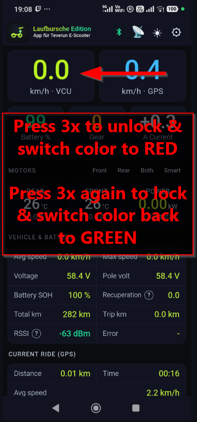</p>

## Screenshots

The screenshots are not kept in step with every release, so a screen can look different in the version you are running.

<table>
  <tr>
    <td align="center" width="33%"></td>
    <td align="center" width="33%"></td>
    <td align="center" width="33%">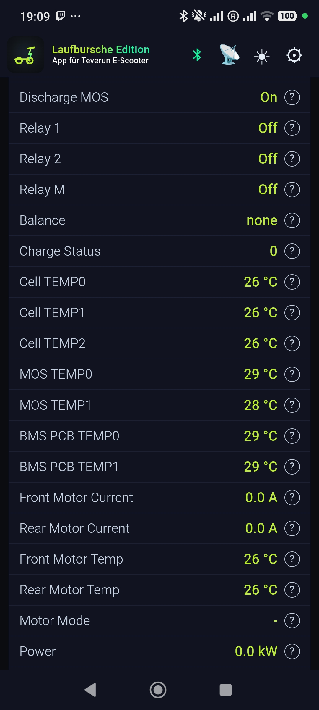</td>
  </tr>
  <tr>
    <td align="center">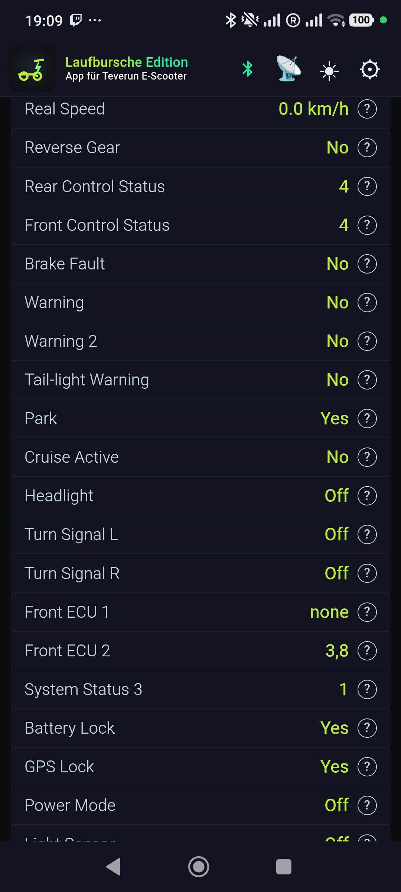</td>
    <td align="center"></td>
    <td align="center">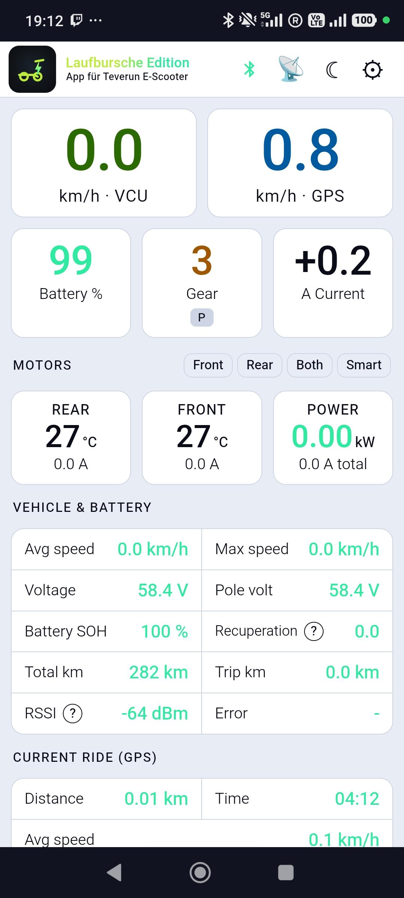</td>
  </tr>
  <tr>
    <td align="center">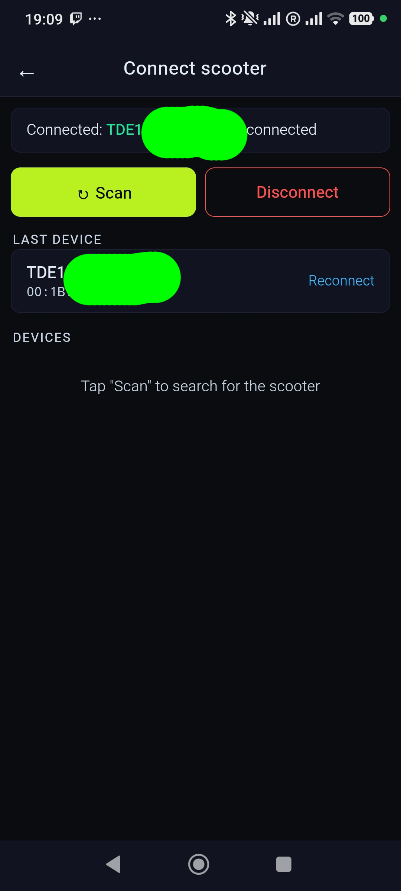</td>
    <td align="center"></td>
    <td align="center"></td>
  </tr>
  <tr>
    <td align="center"></td>
    <td align="center"></td>
    <td align="center"></td>
  </tr>
  <tr>
    <td align="center"></td>
    <td align="center">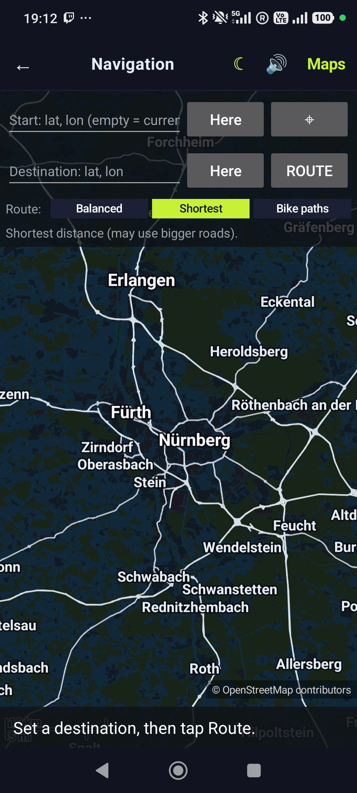</td>
    <td align="center"></td>
  </tr>
  <tr>
    <td align="center"></td>
    <td align="center">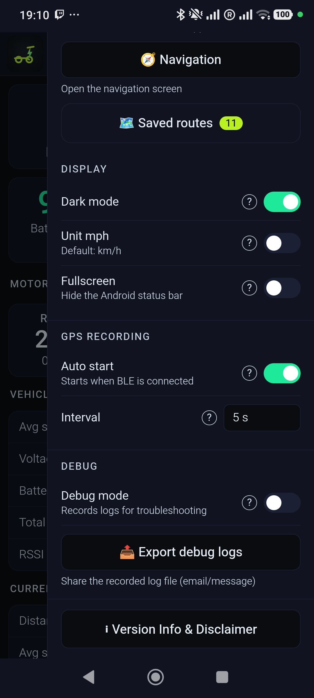</td>
    <td align="center"></td>
  </tr>
  <tr>
    <td align="center"></td>
    <td align="center">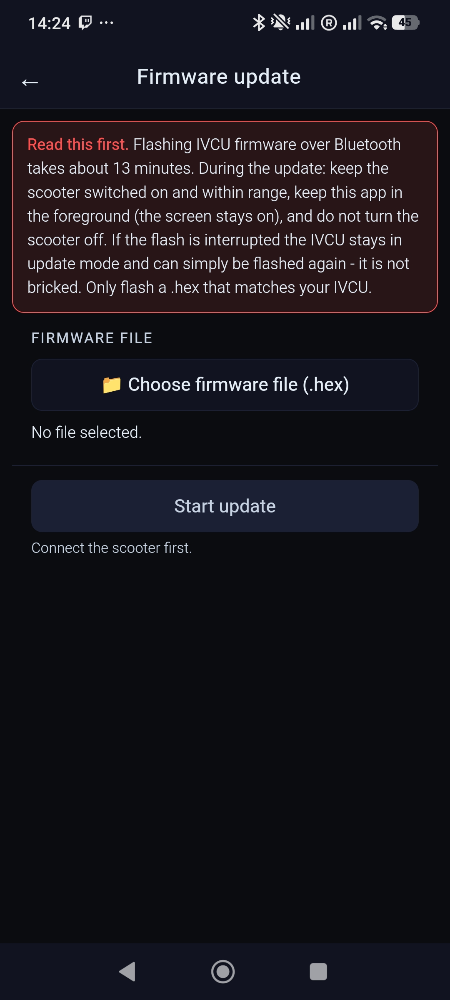</td>
    <td align="center">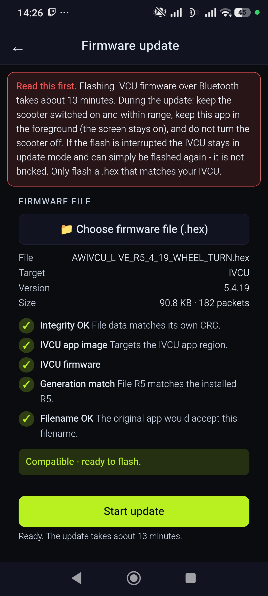</td>
  </tr>
  <tr>
    <td align="center">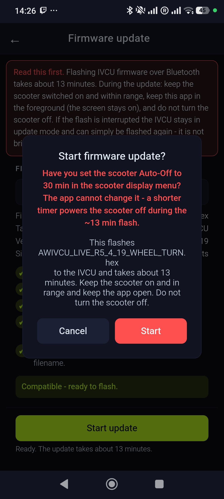</td>
    <td align="center">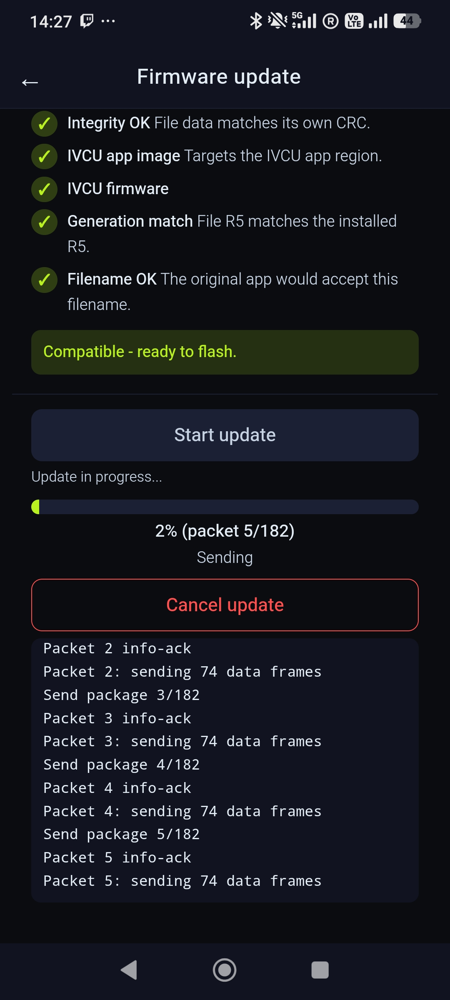</td>
    <td align="center">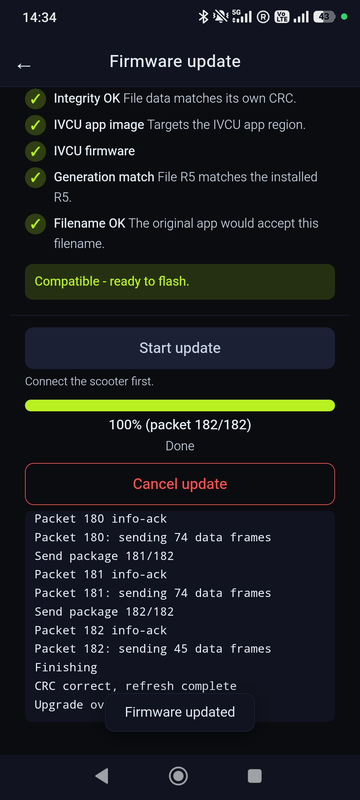</td>
  </tr>
</table>

## Installing the app

There are two ways to install the app. The normal one is a plain sideload from a file manager (below), which keeps working on every phone including Xiaomi/MIUI. A computer/ADB install is only a power-user fallback.

### Normal install (file manager)

Copy the `Laufbursche-Edition-vX.apk` file to your phone and open it in a file manager to install it. No PC and no cables are needed - offline maps are downloaded inside the app.

**Allow "install unknown apps" (Android 8 and newer).** Because the app does not come from the Play Store, Android must be allowed to install it. The first time you tap the downloaded APK, Android will ask you to let the app you opened it with (your file manager or browser) "install unknown apps" - enable that then tap the APK again to install. Alternatively you can pre-enable it under **Settings -> Apps -> [your file manager] -> Install unknown apps -> Allow**. This is only needed for the file-manager install path; the ADB path below does not need it.

### Installing after 2026 (the "advanced flow")

From 2026 Google is phasing in developer verification: on certified devices, in affected regions, an app whose developer has not verified their real-world identity can no longer be installed straight from a file manager without a one-time device opt-in. This app is distributed without a verified developer account (identity verification would expose the author's personal details), so on an affected device the user enables Android's "advanced flow" once. It is a per-device, one-time setup - nothing about it is per-app and nothing is required from the developer.

The one-time steps on the phone:

1. Turn on Developer mode: Settings -> About phone -> tap the build number 7 times.
2. Confirm you are not being talked through this by someone else (an anti-coercion check that blocks scam-driven installs).
3. Restart and re-authenticate - this cuts off any remote-access session or ongoing call an attacker might be using to watch along.
4. Wait out a one-time 24-hour "security wait" then confirm with your fingerprint/PIN that it is really you.
5. Done - you can now install apps from unverified developers from the file manager as usual. The installer still shows an "unverified developer" warning; tap "Install Anyway". You can allow this for 7 days or keep it on permanently.

Because it ships through Google Play services it is the normal file-manager path, not ADB, so it works on every phone including Xiaomi/MIUI - MIUI's separate ADB restriction is irrelevant here.

When it applies:

- The advanced flow itself becomes available around August 2026 through a Google Play services update, so if the option is not in your Developer options yet it simply has not rolled out to your device.
- Verification enforcement starts 2026-09-30 in Brazil, Indonesia, Singapore and Thailand and reaches most other regions (Germany included) in 2027 and later. Until it reaches your region, plain sideloading works unchanged and you do not need the advanced flow at all.

Sources: [9to5Google - the advanced flow, with screenshots](https://9to5google.com/2026/03/19/android-advanced-flow-sideloading/), [Google - developer verification FAQ](https://developer.android.com/developer-verification/guides/faq), [Help Net Security - rollout timeline](https://www.helpnetsecurity.com/2026/06/19/android-developer-verification-rollout-markets/).

### Installing via ADB

You can also install from a computer over ADB (Android platform-tools). This is mainly for developers; for normal use the file-manager route above is simpler and, on Xiaomi, the only friction-free option. Enable ADB once on the phone then install from the computer.

1. On the phone - enable it once:
   - Open Settings -> About phone and tap "Build number" 7 times to unlock Developer options.
   - Open Settings -> System -> Developer options and turn on "USB debugging".
   - Connect the phone to the computer by USB and confirm the "Allow USB debugging" prompt on the phone.
2. Install the APK from the computer:
   - `adb install -r Laufbursche-Edition-vX.apk` (the `-r` reinstalls/updates if a previous version is present).
   - If that fails because a different signature is installed, uninstall the old one first: `adb uninstall com.laufbursche.edition` then `adb install`.
   - On Xiaomi (MIUI/HyperOS) a fresh ADB install of a new app is blocked with `INSTALL_FAILED_USER_RESTRICTED` unless you first enable "Install via USB" in Developer options, which Xiaomi ties to a signed-in Mi account plus an online check (there is no account-free ADB bypass on stock firmware without root). On Xiaomi the file-manager route above is the easier path - only that avoids Xiaomi's ADB gate.
3. Where to get ADB (Android SDK Platform-Tools) - it is a small standalone download, no full Android Studio needed:
   - Official downloads: https://developer.android.com/tools/releases/platform-tools
   - Windows: download the "SDK Platform-Tools for Windows" zip, extract it then run `adb.exe` from a terminal opened in that folder (or add the folder to PATH).
   - macOS: download the "SDK Platform-Tools for Mac" zip and run `./adb` from the extracted folder or install via Homebrew: `brew install android-platform-tools`.
   - Linux: download the "SDK Platform-Tools for Linux" zip and run `./adb` or install your distro package (Debian/Ubuntu: `sudo apt install adb`; Arch: `sudo pacman -S android-tools`; Fedora: `sudo dnf install android-tools`).

## Privacy & data protection

The app collects **nothing** - no accounts, no analytics, no telemetry, no tracking and no ads. Everything stays on your device. It uses the network only on your explicit action, reaching only: your scooter over **Bluetooth LE**; the **Hochschule Esslingen** OpenStreetMap mirror (`ftp-stud.hs-esslingen.de`) for offline **maps**; the **BRouter** server (`brouter.de`) for **routing** data; this project's **GitHub** repo (`github.com/Laufbursche42/tr-lb-edition`) for **POI** data (camping + EV charging) and for the in-app **app-update** check and download; and the **SRT** server URL you configure yourself for screen streaming. Nothing is ever sent to the developer or to any manufacturer backend.

See [PRIVACY.md](PRIVACY.md) for the full privacy policy.

## Permissions

The app requests only what it needs - see [PERMISSIONS.md](PERMISSIONS.md).

## Disclaimer & Trademarks

**Feasibility study, no warranty.** Laufbursche Edition is a feasibility study. The software is provided "as is". Nothing here promises that it is free of defects, that it works on your scooter or your phone, that a value it shows is correct or that a feature still works after the next scooter firmware or Android release.

**At your own risk.** You use this app, the settings it writes and its firmware update at your own risk. As far as the law allows, the developer is not liable for damage to the scooter, its controller, its battery or any other part, for lost data, for injury or for any other loss that comes out of using this software. Writing settings or flashing firmware can leave a scooter unusable and can void its warranty. Keeping to road traffic law stays your job: a scooter set up outside its approved configuration does not belong on public roads.

This is an independent, community project. It is not an official Teverun app and the developer ("Laufbursche") is not affiliated with, endorsed by or connected to Teverun. "Teverun" and other product names are trademarks of their respective owners; the name is used here only descriptively to indicate the scooters this app works with. See [TRADEMARKS.md](TRADEMARKS.md) for details.

# For developers

## Architecture

A native Java `Activity` hosts a `WebView` dashboard (`assets/dashboard/telemetry.html`) bridged to native code via a `@JavascriptInterface` object named `LB`. Native `BleManager`, `FrameParser`, `CommandBuilder` and `SettingsState` implement the UART-over-BLE VCU protocol (see the "BLE protocol reference" section below). Screen streaming lives in the `com.lb.srt` module. Offline navigation uses **Mapsforge** for maps and **BRouter** for routing, with a foreground-service downloader for on-demand map and routing-segment data.

## Prerequisites

- **JDK 21** (JDK 17 also works). Point `JAVA_HOME` at your chosen JDK.
- **Android SDK** - the command-line SDK is enough. You need the `platform-tools` package plus the compile SDK the project builds against.
- **adb** ships inside the Android SDK platform-tools. It is only needed to install over USB (see [Installing via ADB](#installing-via-adb)); it is not required to build.

> **Version numbers - do not confuse them.** These are unrelated scales, so a higher or lower number in one does not say anything about "newer" or "older" in another (for example JDK 21 sitting next to minSdk 26 does not make 21 the older one):
>
> - **JDK 21** - the Java build tool (LTS). This is a Java version, unrelated to Android API levels. It is the version the Android build tooling (AGP/Gradle) officially supports; newer JDKs are not the supported baseline.
> - **compileSdk 36** - builds against Android 16 (the newest Android SDK).
> - **targetSdk 36** - targets Android 16.
> - **minSdk 26** - the OLDEST Android the app runs on (Android 8.0). This is a minimum/floor for device support, not "the version we use" - a lower minSdk means MORE phones are supported.
> - **Java language level 21** - the Java syntax the app source uses (compiled to Android).

## Building from source

Two build types are available. Debug is the quick everyday build; release is what you distribute publicly.

### Debug build

```bash
export JAVA_HOME=/path/to/jdk-21
./gradlew assembleDebug
```

The APK lands at `app/build/outputs/apk/debug/app-debug.apk`. It is signed automatically with Android's debug key (no keystore setup needed), it is debuggable, it is not optimized or minified. This is the build used for development and testing - the versioned test APKs are debug builds.

### Release build

```bash
./gradlew assembleRelease
```

The output lands in `app/build/outputs/apk/release/`. A release APK must be signed with your own keystore, so the freshly built APK is not installable until you configure signing. One-time setup:

1. Create a keystore once:

   ```bash
   keytool -genkeypair -v -keystore release.keystore -alias release \
     -keyalg RSA -keysize 2048 -validity 10000
   ```

2. Add a `signingConfigs { release { ... } }` block to `app/build.gradle`. Read the keystore path and passwords from a gitignored `keystore.properties` file so no secret is ever committed:

   ```properties
   # keystore.properties (DO NOT COMMIT)
   storeFile=release.keystore
   storePassword=your-store-password
   keyAlias=release
   keyPassword=your-key-password
   ```

3. Reference that signing config from `buildTypes.release` in `app/build.gradle`.
4. Build the signed APK with `./gradlew assembleRelease`.

Release builds are what you distribute publicly: optimized, shrinkable via `minifyEnabled`, signed with your own key. The keystore filename and alias shown here are just labels you can choose freely; only the keystore file itself and the passwords are secret and must stay private (gitignored, never committed).

### Debug vs release

| Aspect | Debug | Release |
|--------|-------|---------|
| Signing key | Android debug key (automatic) | your own keystore |
| Debuggable | yes | no |
| Optimization / minify | off | optional (on when `minifyEnabled true`) |
| Purpose | development / testing | public distribution |

Debug builds are only for local development and testing (fast iteration while developing). The builds that end users download from the GitHub Releases page are signed release builds, produced with the release build plus signing config described above and built by the release CI workflow - so users get a signed release, not a debug build. A release signing config is intentionally not committed - keystores must stay private and out of git (the pre-commit secret hook and `.gitignore` already block `*.jks` / `*.keystore` files).

## BLE protocol reference

The UART-over-BLE VCU wire protocol - frame layout, command set and settings model - is documented inline below. This documents the UART-over-BLE protocol of the Teverun VCU as observed on the radio link and validated against a Teverun Fighter Mini Pro (eKFV). It covers the frames and commands that appeared on the link; the firmware may support further frames that never showed up there, other models may differ and fields are marked where they stay uncertain.

### Transport summary

Proprietary UART-over-BLE, ISSC / Microchip Transparent UART profile. Not OBD/OBD2. Every application frame is exactly 20 bytes: a 1-byte sync/header, a 1-byte command id, 17 payload bytes and a trailing 1-byte CRC-8. Multi-byte numeric fields are big-endian, unsigned; signedness is emulated with fixed offsets (current -1000, temperature -40).

---

### 1. BLE connection

#### 1.1 UUIDs

| Role | UUID |
|------|------|
| Service | any primary service whose UUID (uppercased) `startsWith("0000FF")` or `startsWith("495353")` |
| Notify (VCU -> phone) | `49535343-1e4d-4bd9-ba61-23c647249616` |
| Write (phone -> VCU) | `49535343-aca3-481c-91ec-d85e28a60318` |

The scooter this app targets uses the ISSC Transparent UART service (`49535343-...`). The canonical 16-bit-style base for that service is `49535343-fe7d-4ae5-8fa9-9fafd205e455` (only the prefix `495353...` is matched in code - do not hard-code the full service UUID; discover it).

Characteristic selection: on a `495353...` service use the two ISSC characteristic UUIDs listed
above. On a `0000FFxx` service take the characteristic that advertises the NOTIFY property for
telemetry and the one that advertises WRITE for commands, because the order they are handed out
in is not reliable.

So: if the service is `495353...`, use the two hard-coded characteristic UUIDs above. Otherwise (a `0000FFxx` service) pick the characteristic that advertises the `notify` property as notify and the one that advertises `write` as write.

> A second, older service exists as a fallback for some older or other units: the Microchip RN487x data service, matched by a service UUID containing `0003CDD0` with characteristics `0003CDD2` (write) and `0003CDD1` (notify). It is not the active telemetry path; the live path is the ISSC service described above.

Connection identifiers worth persisting: `deviceId`, `name`, `serviceId`, `notifyId` and `writeId`.

#### 1.2 Scan / device identification

Scan filter: accept a discovered device whose advertised name or local name starts with `XY`,
`T` or `BT04`. The single-character `T` is deliberately broad, since every Teverun identity
string begins with it. This is a scan filter only, it classifies nothing.

The scan accepts any device whose name or local name starts with one of the literal prefixes `XY`, `T` or `BT04`. The single-character `T` prefix is deliberately broad: every Teverun model name begins with `T` (`T1...`, `T2...`, `TDE...`, `TAT...` and so on), so matching `T` catches all of them. This is only the scan filter - it does not classify the model.

Model / feature identification from the BLE advertised name happens after the GATT link is up and only sets client-side feature flags (for example the gear range and whether it is a v2 platform). It is not needed to communicate with the VCU.

The classification hinges on a single question: does the identity string start with `T2`?

- Names starting with `T2` are the ver2 platform.
- Every other `T`-prefixed name (`T1...`, `TDE...`, `TAT...`, ...) belongs to the older T1 class. `TDE` is a T1-class model precisely because it does not start with `T2` (the name is `TDE`, not `T2DE`) and the same holds for `TAT`. `T2` is therefore the single discriminator between the two platforms, not one option among several parallel model prefixes.

| Identity prefix | ver2 | Gear range | Notes |
|-----------------|------|------------|-------|
| `T2...` | yes | 0-5 | the ver2 platform, which also offers traction control (TCS) |
| `T1...` | no | 0-5 | the ECU variant; `T1IL...` is its Israeli form |
| `TDE...` or `TAT...` | no | 2-4 | eKFV units. The scooter's own display shows these as 1-3 |
| anything else | no | 0-5 | |

> The gear index travels in `55 71` t[3] and that frame is the only source for it. A client should
> follow what the VCU reports rather than a table, which is why this one carries no more than the
> range to expect.

The characters after the prefix carry a cosmetic model name for display. Only the first three
characters matter for talking to the VCU, because they carry the regional marker the firmware acts
on. Everything after that is decoration and this app does not depend on it.

> The advertised name is more than a label: it is the VCU's device-identity string, which is the scooter's FIN. It is stored in the VCU's I2C EEPROM config block (persisted), mirrored to RAM at boot and changeable at runtime over BLE with command 0x1f (Section 3.6) - no firmware flash, persisted to EEPROM, reversible. Its first three characters gate the firmware speed clamp: a name starting with `TDE` is the restricted eKFV marker (see the [Firmware](https://github.com/Laufbursche42/tr-fw/blob/main/README.md#firmware-reverse-engineering) section). Robust name resolution: on a non-bonded LE connection the advertised name is often empty, so the app also reads the GAP Device Name characteristic (service `0x1800`, characteristic `0x2A00`) right after connecting, plumbs the known name through its `connect(addr, name)` path and never persists an empty name.

#### 1.3 Connect, MTU, notifications

Connect, then wait a moment (about 1.5 s) before discovering services: subscribing too early loses
the first notifications on some Android stacks. Reconnect when the link drops.

- **MTU:** frames are 20 bytes, so the default ATT MTU of 23 carries one frame per packet and no
  negotiation is needed.
- **Notifications, not indications:** enable notify locally and write `01 00` to the CCCD `0x2902`.
- **Keep-alive:** the VCU streams telemetry unsolicited once it has been greeted. Send the
  handshake frame after connecting and repeat it about every 6.5 s; without it the stream stops.
  There is no per-frame polling command.

#### 2.1 Receive pipeline

A single BLE notification may carry several 20-byte frames one after the other, so split the
buffer every 20 bytes before doing anything else. Accept a frame only when it is exactly 20 bytes
long and its CRC-8 over bytes `[0..18]` equals byte `[19]`; drop it otherwise, silently. Then
dispatch on byte `[0]`, the sync byte `0x55`, plus byte `[1]`, the frame id.

A 16-bit value spans two bytes, high byte first.

#### 2.2 How a packed byte is read

Three packings appear in the frames below. The tables refer to them by these names.

| Packing | Layout |
|---------|--------|
| bit array | one flag per bit, listed LSB-first: index `[0]` = bit 0 ... index `[7]` = bit 7 |
| nibble pair | `[high nibble, low nibble]` = `[bits 7..4, bits 3..0]` |
| timer byte | sleep timer = `byte & 0x07`, power-off timer = `(byte >> 3) & 0x1F` |

#### 2.3 Version / identity frames

| Frame | Field(s) | Bytes -> value | Field name |
|-------|----------|----------------|------------|
| `55 41` | Battery serial | `t[2..16]` (15 bytes) ASCII, trimmed; prefix `"AW"` if missing | `batCode` |
| `55 42` | VCU frame number | `t[2..18]` (17 bytes) ASCII | `frameNum` |
| `55 43` | VCU SW / HW | if `t[2]>0`: `swVer = t[2].t[3].t[4]` (decimal). Traction control is available if `3 <= t[3] <= 10`. if `t[6]>0`: `hwVer = t[6].t[7].t[8]` | `swVer`, `hwVer` |
| `55 44` | Display / Battery / LC fw | `t[2]` = display product type, `t[3]` = display product code, `t[4].t[5].t[6]` = display SW; `t[8]/t[9]`+`t[10..12]` = battery; `t[14]/t[15]`+`t[16..18]` = LC. (`FF FF FF` -> `-.-.-`) | - |
| `55 45` | Main / secondary ctrl | `t[2]/t[3]`+`t[4..6]` = rear main controller version; `t[8]/t[9]`+`t[10..12]` = front main controller version | - |
| `55 4D` | Extra controllers (4-motor) | `t[2]/t[3]`+`t[4..6]` = second rear controller version; `t[8]/t[9]`+`t[10..12]` = second front controller version | - |

> The scooter's identity string (its FIN, used as the BLE advertised name) is not one of these telemetry frames. It is read from the advertised name or the GAP Device Name characteristic (Section 1.2) and can be changed with command 0x1f (Section 3.6). Its first three characters (`TDE` on an eKFV unit) gate the firmware speed clamp - see the [Firmware](https://github.com/Laufbursche42/tr-fw/blob/main/README.md#firmware-reverse-engineering) section.

#### 2.4 Live telemetry frames

`raw` below is the unsigned value of the byte or byte pair named in the first column.

##### `55 52` - Battery voltage / current / SOC / temperatures

| Bytes | Formula | Field name | Unit |
|-------|---------|------------|------|
| `t[2]+t[3]` | `raw * 0.1` | `packVoltage` (measured pack voltage) | V |
| `t[4]+t[5]` | `raw * 0.1` | `poleVoltage` | V |
| `t[6]+t[7]` | `raw * 0.1 - 1000` | pack current; < 0 = regeneration | A |
| `t[8]` | `raw` | `SOC` | % |
| `t[9]` | `raw * 0.01 * 100` (= `raw`) | `soh` | % |
| `t[10]...t[16]` | `raw - 40` | battery temps 1-7 | C |
| `t[17]` | `raw - 40` | max cell temp | C |
| `t[18]` | `raw - 40` | min cell temp | C |

##### `55 53` - BMS relays / capacity / cell voltages

| Bytes | Formula | Field name | Unit |
|-------|---------|------------|------|
| `t[2]` | `raw` | `relay1` | bool |
| `t[3]` | `raw`; also a bit array of the pack status when `!= ff` | `relay2` | bool |
| `t[4]` | `raw` | `relay3`; also `charMode` | - |
| `t[5]` | `raw` | `chrMosState` | - |
| `t[6]` | `raw` | `dischrMosState` | - |
| `t[7]` | bit array | `balState0` (cell balancing, one bit per cell) | - |
| `t[8]+t[9]` | `raw` (T1 class) | capacity | Ah |
| `t[10]+t[11]` | `raw` (ver2) | capacity | Ah |
| `t[12]+t[13]` | `raw` | `chargeCounter` | cycles |
| `t[14]` | `raw` | cell count | - |
| `t[15]+t[16]` | `raw` | max cell voltage | mV |
| `t[17]+t[18]` | `raw` | min cell voltage | mV |

##### `55 54` - Error codes / charge status

| Bytes | Meaning |
|-------|---------|
| `t[2..18]` | fault array, 17 entries: the position in the array is the fault type and the byte value is its severity. `0` means no fault; anything above `3` still counts as `3`. |
| `t[17]` | `chargeStatus` (charge-image index) |

The app rolls the array up into one warning level: any severity above `2` (except at index 16) gives `2`; otherwise index 0 or index 2 above severity `1` gives `1`; otherwise `0`.

##### `55 71` - Main control: gear / limits / system status

| Bytes | Formula | Field name | Unit |
|-------|---------|------------|------|
| `t[3]` | `raw` | `gear` | 1-5 |
| `t[4]` | bit array | `rControlStatus` | - |
| `t[5]` | `raw` | `motorPolePairs` | - |
| `t[6]` | `raw * 0.1` | `wheel` (wheel size, internal unit) | - |
| `t[7]` | `raw` | `protectionTemp` | C |
| `t[8]` | nibble pair | assist byte 1: low nibble = `frontStartLevel` | - |
| `t[9]` | nibble pair | assist byte 2: high nibble = `eabsRegen`, low nibble = `rearStartLevel` | - |
| `t[10]` | `raw` | per-gear `speedLimit` | km/h |
| `t[11]` | `raw` | main `speedLimit` | km/h |
| `t[12]` | `raw` | `frontCurrent` | - |
| `t[13]` | `raw` | `rearCurrent` | - |
| `t[15]` | `raw` | `packVoltage` (nominal, the configured pack size) | V |
| `t[16]` | bit array | `fControlStatus` | - |
| `t[17]` | bit array | `systemStatus` (see below) | - |
| `t[18]` | timer byte | `sleepTime` = `t[18]&7`, `prTime` = `(t[18]>>3)&31` | - |

Status bits in `t[17]`, LSB-first: `[0]` `ecoMode`, `[1]` `unitMiles` (miles instead of kilometres), `[2]` `antiTheft`, `[4]` `tractionControl`, `[5]` reverse gear, `[6]` a hardware flag set on eKFV units, `[7]` monitor mode.

This frame reports only the CURRENTLY active gear (`t[3]`) together with that gear's per-gear/assist values (`t[8]`-`t[13]`). There is no bulk read of all gears, so to populate every gear's values in the editor the scooter has to be switched through each gear once (the app caches them per session in memory only, never on disk). On eKFV (TDE) units the internal gears 2/3/4 map to 1/2/3 on the scooter display.

`rControlStatus` bits (`t[4]`, LSB-first): cruise level = `(bit2 << 1) | bit1`, `[3]`=ABS, `[6]`=`startMode` (launch).

##### `55 72` - Motor: current / temp / ECU status / raw speed

| Bytes | Formula | Field name | Unit |
|-------|---------|------------|------|
| `t[2]` | bit array | `fEcuStatus1` | - |
| `t[3]` | bit array | `fEcuStatus2`; `[3]` = `dualMotor` | - |
| `t[4]+t[5]` | `raw * 0.1` | `frontMotorCurrent` | A |
| `t[9]` | `raw` (kept only if `>0`) | `frontMotorTemp` | C |
| `t[10]` | bit array | `ecuStatus1` | - |
| `t[11]` | bit array | `ecuStatus2`; `[3]` = `rearMotorOn`, `[4]`=headlight, `[5]`/`[6]`=turn signals | - |
| `t[12]+t[13]` | `raw * 0.1` | `rearMotorCurrent` | A |
| `t[15]+t[16]` | `raw` | `speedRaw` | raw |
| `t[17]` | `raw` (kept only if `>0`) | `rearMotorTemp` | C |
| `t[18]` | bit array (if `!= ff`) | `systemStatus3` | - |

`ecuStatus1` bits: `[0]`=brake fault, `[2]`=warning type2 (tail-light), `[3]`=warning, `[4]`=warning2, `[7]`=park (P). `ecuStatus2` bits: `[0]`=cruise active, `[3]`=`rearMotorOn`, `[7]`=park (P).

##### `55 73` - Ride: avg/max speed / distance / energy

| Bytes | Formula | Field name | Unit |
|-------|---------|------------|------|
| `t[2]+t[3]` | `raw * 0.1` | `avgSpeed` | km/h |
| `t[4]+t[5]` | `raw * 0.1` | `maxSpeed` | km/h |
| `t[6]+t[7]` | `raw * 0.1` | `singleMile` (trip) | km |
| `t[8]+t[9]+t[10]` | `raw` (3 bytes, BE) | `totalMile` (odometer) | km |
| `t[11]+t[12]` | `raw * 0.1` | `enFeedBack` (cumulative regen) | unit unverified |
| `t[16]` | bit array (if `!= ff`) | `systemStatus2`: `[0]`=battery lock, `[1]`=GPS lock; `(bit7<<1)\|bit6` = power level | - |
| `t[17]` | `raw` | `customKey` (current custom-key function) | - |
| `t[18]` | bit array (if `!= ff`) | `[3]`=power mode, `[4]`=light sensor, `[5]`=voice, anti-theft level = `(bit7<<1)\|bit6` | - |

##### `55 79` - 4-motor control status (Tetra)

`t[4]` and `t[16]` are bit arrays: the control status of the second rear motor and of the second front motor.

##### `55 7A` - 4-motor rear/front (Tetra)

| Bytes | Formula | Meaning | Unit |
|-------|---------|---------|------|
| `t[2]` | bit array | second front motor: controller status | - |
| `t[4]+t[5]` | `raw * 0.1` | second front motor: current | A |
| `t[9]` | `raw` (if `>0`) | second front motor: temperature | C |
| `t[10]` | bit array | second rear motor: controller status | - |
| `t[12]+t[13]` | `raw * 0.1` | second rear motor: current | A |
| `t[17]` | `raw` (if `>0`) | second rear motor: temperature | C |

#### 2.5 Derived values

Road speed, from the raw speed value and the wheel size:

```
speed_kmh = 287 * wheel / speedRaw            // wheel = 55 71 t[6]*0.1
speed_mph = speed_kmh / 1.6093439
if (speedRaw >= 3000 || speed <= 0.5) speed = 0
```

The speed is carried in mph when the unit is set to miles, otherwise in km/h. Any cap a client puts on top of that is its own doing; the frame carries the value the VCU measured.

Power:

```
single motor: power_kW = rearMotorCurrent * packVoltage / 1000
dual motor:   power_kW = (rearMotorCurrent + frontMotorCurrent) * packVoltage / 1000
```

Live regeneration: from `55 52` current = `t[6]+t[7]` * 0.1 - 1000; `current < 0` => regen, `|current|` = fed-back current [A].

#### 2.6 Field names used in this app

These are the names Laufbursche Edition gives the decoded values. They are our labels for the bytes described above, nothing the scooter ever sends: the link carries numbers, not names.

Ride and drive: `speed`, `speedRaw`, `avgSpeed`, `maxSpeed`, `power`, `gear`, `speedLimit`, `singleMile`, `totalMile`, `enFeedBack`, `customKey`.

Motors: `frontMotorCurrent`, `rearMotorCurrent`, `frontMotorTemp`, `rearMotorTemp`, `dualMotor`, `rearMotorOn`.

Battery: `SOC`, `soh`, `packVoltage`, `poleVoltage`, `chargeCounter`, plus the pack temperatures, the per-cell voltages and the capacity, which feed the Battery info page.

Status bit arrays: `systemStatus[]`, `ecuStatus1[]`, `ecuStatus2[]`, `rControlStatus[]` and `fControlStatus[]`.

GPS position, GPS speed and the BLE signal strength come from the phone, not from the VCU frames.

---

### 3. Outgoing commands (phone -> VCU)

#### 3.1 Frame format & CRC

Every command is a 20-byte frame:

```
[0]  0xAA (170)  header/sync
[1]  cmdId
[2..18]  17 payload bytes (default 0xFF)
[19] CRC-8
```

CRC-8:

- Polynomial `0x07`, init `0x00`, MSB-first, no input or output reflection, no final XOR. That is
  the classic CRC-8/ATM, so any ready-made implementation of it fits.
- Computed over the first 19 bytes `[0..18]`, result placed in byte `[19]`.
- The same computation terminates an outgoing frame and validates an incoming one.

Send path: build the 20-byte frame, compute the CRC into byte `[19]` and write all 20 bytes in a
single GATT write. Retry a handful of times on failure and serialize concurrent writes. The write
characteristic supports both with-response and without-response writes; this app uses with-response
for settings and without-response during a firmware flash, where pacing matters more than
confirmation.

#### 3.2 Frame layout for control commands

Every command frame is 20 bytes. Byte `[0]` is the start marker `0xAA`, byte `[1]` is the command
id, bytes `[2..18]` default to `0xFF` and only the fields a command actually uses are filled in,
byte `[19]` is the CRC-8. The VCU treats anything left at `0xFF` as "no change", which is what
makes a one-field write possible without resending the rest.

#### 3.3 Command id map

| cmdId (dec / hex) | Purpose | Key payload |
|-------------------|---------|-------------|
| 1 / 0x01 | handshake / keep-alive (every 6.5 s) | `[2]=16 (0x10)`, `[3]=0`, `[4..7]` stay at `255` |
| 2 / 0x02 | deep sleep | `[11]=1` |
| 3 / 0x03 | charge mode | `[16]` = mode |
| 8 / 0x08 | LED on/off, RGB, mode | `[2]`=on, `[3]`=mode, `[4..6]`=RGB, `[7]` |
| 24 / 0x18 | full settings write (see Section 3.4) | whole frame |
| 26 / 0x1A | custom-key function | `[6]` = key id (Section 3.5) |
| 28 / 0x1C | RTC time sync | `[2]`=year%100, `[3]`=month (1-12), `[4]`=day, `[5]`=hour, `[6]`=min, `[7]`=sec |
| 31 / 0x1F | set BLE name / VCU identity (see Section 3.6) | `[2..17]` = 16 ASCII name bytes |

The handshake therefore serializes to: `AA 01 10 00 FF FF FF FF FF ... FF <CRC>`.

#### 3.4 The full settings write (cmd 0x18)

The frame carries a write mode and a gear index. It starts as `0xAA 0x18` followed by seventeen `0xFF` bytes; then:

| Index | Value | Meaning |
|-------|-------|---------|
| `a[0]` | `170` (0xAA) | header |
| `a[1]` | `24` (0x18) | cmdId |
| `a[2]` | write mode | `0` normal, `2` immediate (used by the motor toggle and by charge mode). In mode `2` the gear index goes into `a[3]`. |
| `a[3]` | gear (TDE: gear 4 -> 5) | current gear. In mode `2` it holds the gear index being written |
| `a[4]` | control bits | rControlStatus byte - see bit map below |
| `a[5]` | `motorPolePairs` | |
| `a[6]` | `wheel * 10` | wheel size |
| `a[7]` | `protectionTemp` | |
| `a[8]` | nibble pair | assist byte 1: high nibble = `eabsRegen`, low nibble = `frontStartLevel` |
| `a[9]` | nibble pair | assist byte 2: high nibble = `eabsRegen`, low nibble = `rearStartLevel` |
| `a[10]` | per-gear `speedLimit` | speed limit of the gear being written |
| `a[11]` | main `speedLimit` | |
| `a[12]` | `frontCurrent` | front current limit |
| `a[13]` | `rearCurrent` | rear current limit |
| `a[14]` | voltage code (from `packVoltage`) | see voltage-code table below |
| `a[15]` | `packVoltage` | pack nominal voltage (36/48/52/60/72/84) |
| `a[16]` | flag bits | flag byte - see bit map below |
| `a[17]` | control bits with bit 7 = `dualMotor` | fControlStatus byte |
| `a[18]` | `(prTime << 3) \| sleepTime` | sleep / power-off timer |
| `a[19]` | CRC-8 | over `[0..18]` |

`a[14]` voltage code, derived from `packVoltage`:

| `packVoltage` | code |
|----------|------|
| 36 | 30 |
| 48 | 39 |
| 52 | 42 |
| 60 | 48 |
| 72 | 60 |
| 84 | 69 |

`a[16]` flag byte, LSB-first:

| Field | Bit | Mask |
|-------|-----|------|
| `ecoMode` | 0 | `0x01` |
| `unitMiles` (miles instead of kilometres) | 1 | `0x02` |
| `antiTheft` | 2 | `0x04` |
| `tractionControl` | 4 | `0x10` |

`a[4]` / `a[17]` control bytes, LSB-first:

| Field | Bit | Notes |
|-------|-----|-------|
| cruise | 0, 1, 2 | automatic -> bits 0 and 1 set; manual -> bit 2 set; off -> none of them |
| ABS | 3 | |
| `startMode` | 6 | launch mode |
| `rearMotorOn` | 7 | in `a[4]` only |
| `dualMotor` | 7 | in `a[17]` only |

> Bit 0 is the least significant bit of the byte in both control bytes and in the flag byte. The two assist nibbles are the other way round: high nibble first.

Multi-frame behaviour: on a unit that is not the ECU variant the write is repeated once per gear profile, gear index 1 to 5, roughly 200 ms apart. Changing a single setting needs only one frame, sent with the gear index that setting belongs to.

#### 3.5 Custom-key function values

Byte `[6]` of command 0x1A selects what the scooter's physical custom key does:

| Value | Function |
|-------|----------|
| 1 | motor mode |
| 2 | kick to start |
| 3 | cruise control, automatic |
| 4 | speed limit |
| 5 | scooter lock |
| 6 | traction control |
| 7 | lights on / off |
| 8 | light mode |
| 9 | boost |
| 10 | cruise control, manual |
| 11 | EABS regeneration |

Assign a function to the physical custom key with:

```
cmd 0x1A with [6] = N                          // N from the table
// -> AA 1A FF FF FF FF <N> FF FF ... FF <CRC>
```

The current assignment is reported back in `55 73` `t[17]` (`customKey`).

#### 3.6 Identity / device-name change (cmd 0x1f)

The BLE advertised name is the VCU's device-identity string - the scooter's FIN - held in the VCU I2C EEPROM config block and mirrored to RAM (Section 1.2). Command 0x1f rewrites it at runtime. The frame is the usual 20 bytes:

```
[0]      0xAA        header / sync
[1]      0x1F        cmdId
[2..17]  16 bytes    new identity, ASCII (padded / truncated to 16)
[18]     0xFF        unused
[19]     CRC-8       over [0..18]
```

The VCU writes the new identity to EEPROM, so it survives a reboot; it needs no firmware flash and is fully reversible by sending the original name back. The app exposes this as `setDeviceName` / `setBleName`, surfaced as the "Change identity" row in Scooter Info, where the full FIN is editable with a Set button. The app never persists an empty name.

The first three characters of this identity gate the eKFV speed clamp: a name starting with `TDE` is the restricted eKFV marker, while the firmware factory default `AWPE-VCU-220212` is unrestricted. Changing the identity flips Gate 1 of the speed clamp but not Gate 2 (the display), so a name change alone does not raise the top speed. See the [Firmware](https://github.com/Laufbursche42/tr-fw/blob/main/README.md#firmware-reverse-engineering) section for the full picture.

---

### 4. Motor enable / disable (single vs dual, drive mode)

The motor-mode toggle cycles the drive mode and then writes the full settings frame in mode 2:

```
current (rearMotorOn, dualMotor)             next state
----------------------------------------     ----------
dual  (rearMotorOn=1, dualMotor=1)    ->     rear-only  (rearMotorOn=1, dualMotor=0)
rear-only                             ->     front-only (rearMotorOn=0, dualMotor=1)
front-only                            ->     dual       (rearMotorOn=1, dualMotor=1)
then: settings write, mode 2                 // cmd 0x18
```

On the wire (write, cmd 0x18):

- `a[4]` bit 7 = `rearMotorOn` (rear motor active)
- `a[17]` bit 7 = `dualMotor` (dual / front motor active)

Read-back (cmd 0x72):

- `dualMotor` = `fEcuStatus2[3]` = bit 3 of `t[3]`
- `rearMotorOn` = `ecuStatus2[3]` = bit 3 of `t[11]`

> Caution - verify on device. The write encodes these two flags in bit 7 of control bytes `a[4]` / `a[17]`, whereas the read-back decodes them from bit 3 of different status bytes in the `55 72` frame. They are distinct bytes in distinct frames, so there is no direct contradiction, but the exact VCU-side bit position for commanding single vs. dual motor should be confirmed against a live VCU. There is no dedicated "motor" opcode - motor mode is only ever changed through the full settings write (cmd 0x18) and the custom-key motor function (value 1, Section 3.5) merely maps the hardware button to this same toggle.

`motorPolePairs` (`a[5]` out / `55 71` `t[5]` in) is a motor parameter, not an enable flag.

---

### 5. Implementation notes (for the Java layer)

- Endianness: all multi-byte numeric fields are big-endian (`hex[n] + hex[n+1]` in stream order, high byte first). `55 73 totalMile` is a 3-byte BE value (`t[8]+t[9]+t[10]`).
- Signedness: every raw value is treated as unsigned; negative results come from fixed offsets - current `raw*0.1 - 1000`, all temperatures `raw - 40`. There are no two's-complement fields.
- Byte representation: index the raw `byte[]` directly and mask with `& 0xFF`. Frame = `byte[20]`.
- Frame gating: only accept a 20-byte frame whose CRC-8 (poly `0x07`, init `0x00`, MSB-first) over bytes `[0..18]` equals byte `[19]`. Drop otherwise. A single BLE notification may contain several concatenated 20-byte frames - split every 20 bytes before validating.
- Dispatch: incoming header byte `[0] = 0x55`; command in `[1]`. Outgoing header `[0] = 0xAA`; command in `[1]`; CRC in `[19]`.
- Bit order: every status byte is read and written LSB-first (array index 0 = bit 0). The assist nibbles are the exception, high nibble first.
- Notifications, not indications: enable local notify + write CCCD `0x2902` = `0x01 0x00`.
- Startup sequence: connect -> discover services (pick primary `0000FF...` / `495353...`) -> discover characteristics (notify/write per Section 1.1) -> enable notifications (CCCD) -> send the handshake frame and repeat every ~6.5 s. Telemetry then streams unsolicited; no per-frame request is needed.
- Writes: send the complete 20-byte frame in a single GATT write; retry a few times on failure. Serialize concurrent writes; the multi-frame settings write wants roughly 200 ms between frames.
- Uncertain items (flagged above): (a) exact VCU bit for single/dual-motor commanding - see Section 4; (b) `enFeedBack` physical unit - unverified; (c) preferred write type (with vs. without response) - the default is with-response.

## License

**What it covers and what it does not.** The licence covers what is in this repository: the Laufbursche Edition app, its build files and this documentation. It does **not** cover the scooter's Bluetooth protocol nor the manufacturer's firmware. Neither of those is ours, so neither is ours to license. Nothing here gives you any right in them. The protocol reference above is a written record of what was observed on the wire, so that the app can be understood, checked and maintained. Describing an interface is not the same as owning it. A description grants nothing. "Teverun" and the scooter firmware belong to their respective owner, see [Disclaimer & Trademarks](#disclaimer--trademarks).

This project is source-available under the **PolyForm Noncommercial License 1.0.0** plus the Additional Terms in the `license.md` file. In plain language:

- You may **use, modify and share** the software for **noncommercial** purposes.
- **Commercial use requires the author's prior written permission.** To ask, contact the author.
- Any fork must be **renamed** by replacing "Laufbursche" with your own developer name or pseudonym while keeping the word "Edition". For example, if your pseudonym is "Falcon", name it "Falcon Edition". You must not use the name "Laufbursche Edition" (or any confusingly similar name) and must not use the "Laufbursche Edition" logo or brand artwork; use your own name and your own logo. Every fork must also **keep the origin notice** stating that it is based on the original "Laufbursche Edition" by Laufbursche in the app's **Version Info & Disclaimer** screen. That notice must not be removed or hidden.

See the [`license.md`](license.md) file for the full Additional Terms and the complete verbatim license text.

This is **source-available, not OSI "open source"**, by design: the noncommercial restriction means it does not meet the Open Source Definition and that is intentional. It is **not** a pure open-source project in the OSI sense - the source is made **public** so that anyone can inspect it, see exactly what the app does and modify it for their own **private** use.

Once you **publish** your own version (distribute a fork), you must observe the license terms: rename the app by replacing "Laufbursche" with your own developer name or pseudonym while keeping the word "Edition" (for example, "Falcon Edition") and never reuse the name "Laufbursche Edition" or the "Laufbursche Edition" logo, use your **own** name and your **own** logo, keep the origin notice in the app's **Version Info & Disclaimer** screen and keep it **noncommercial** unless you have the author's written permission.
